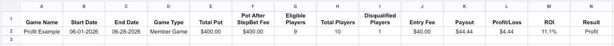
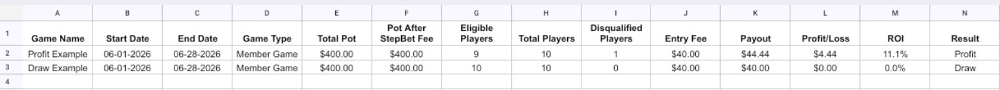
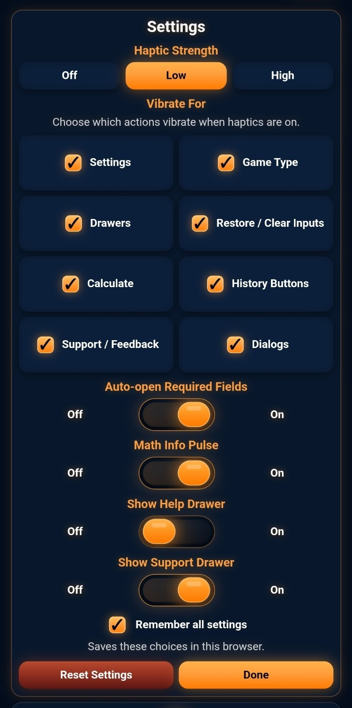
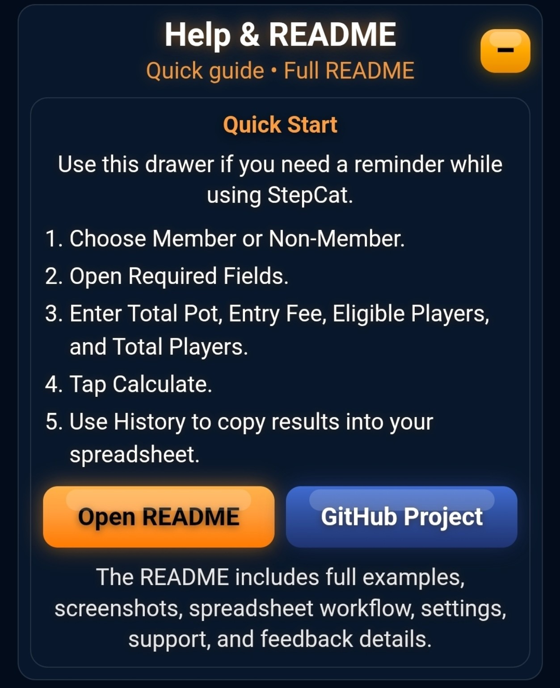
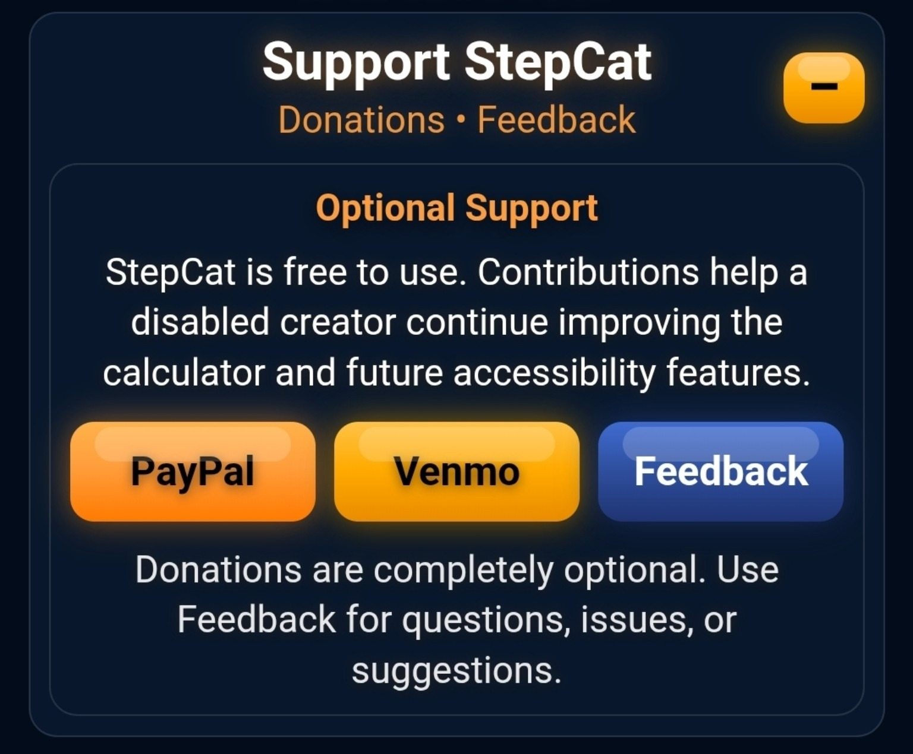
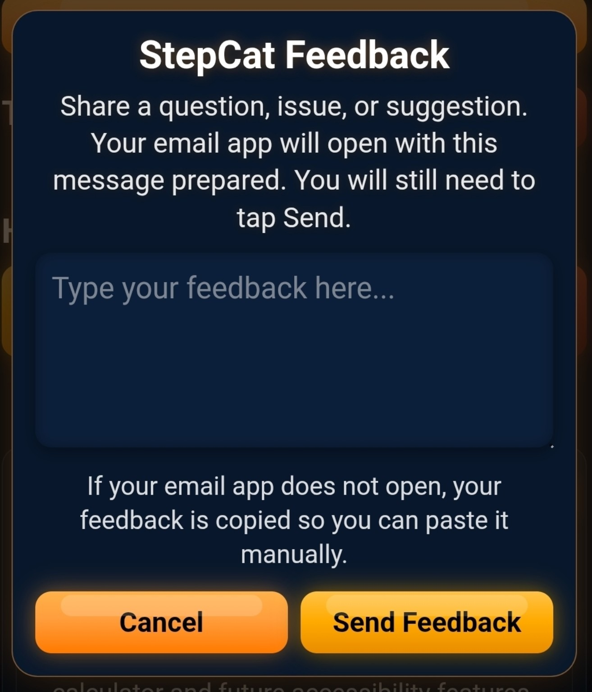
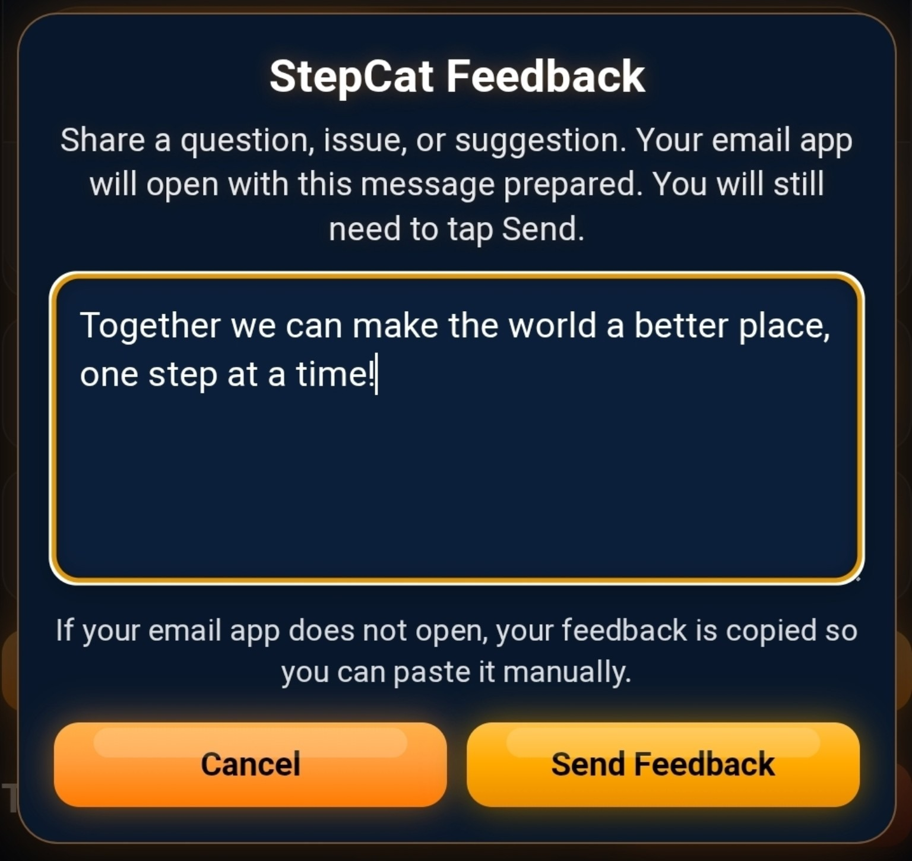
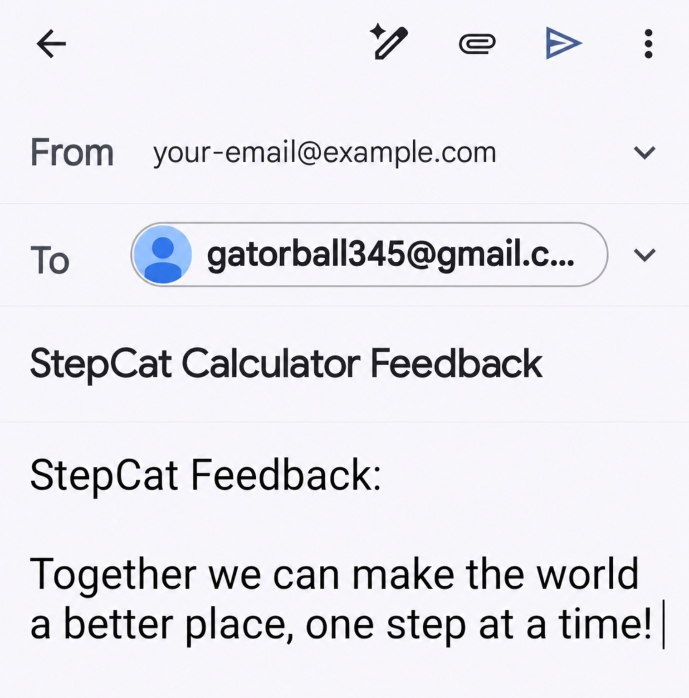

# StepCat Calculator

**StepCat Calculator** is a mobile-friendly step-challenge payout calculator designed to estimate projected payout, profit, draw, ROI, and player-count outcomes for personal step challenges.

It is built as a single-page HTML web app and can be hosted directly with GitHub Pages or another static site host.


## Live App

[Open StepCat Calculator](https://gatorball345-ux.github.io/StepCat-Profit-Calculator-/)

```text
https://gatorball345-ux.github.io/StepCat-Profit-Calculator-/
```

If the link does not open, copy and paste the full URL into your browser.

---

# How to Use StepCat

## 1. Choose the Game Type

Use the **Member / Non-Member** toggle at the top of the app.


### Member Game

In a Member Game, no platform fee is withheld. Eligible players split the full pot.

```text
Payout = Total Pot ÷ Eligible Players
```

### Non-Member Game

In a Non-Member Game, a 15% platform fee is withheld before payout is split. Eligible players split the remaining 85%.

```text
Payout = Total Pot × 85% ÷ Eligible Players
```

Changing the game type also updates the Math Info drawer, which is built into the same Game Type panel.

---

# Math Info

The **Math Info** drawer explains the formula being used.


For Non-Member games:

```text
Payout = Total Pot × 85% ÷ Eligible Players
Profit = Payout − Entry Fee
ROI = Profit ÷ Entry Fee × 100
```


For Member games:

```text
Payout = Total Pot ÷ Eligible Players
Profit = Payout − Entry Fee
ROI = Profit ÷ Entry Fee × 100
```

The Math Info drawer makes the calculation transparent, especially when switching between Member and Non-Member games.

---

# Required Fields

The **Required Fields** drawer contains the inputs needed for the calculation.


## Total Pot

The full challenge pot before payouts are split.

Example:

```text
400
```

## Entry Fee

The actual amount paid to join the challenge.

Example:

```text
40
```

Use the actual entry fee shown for the challenge, not a calculated estimate.

## Eligible Players

The number of players still eligible for payout.

Example:

```text
9
```

Eligible players are the players still in the running to receive a payout.

## Total Players

The number of players who entered the challenge.

Example:

```text
10
```

## Disqualified Players

Disqualified players are calculated automatically.

```text
Disqualified Players = Total Players − Eligible Players
```

A true loss happens when the player is disqualified and must forfeit their entry fee in the challenge.

---

# Optional Details

The **Optional Details** drawer is used for labels, dates, and spreadsheet organization.


These fields are not required for the payout calculation.

## Game Name

Use this to label a saved entry.

Examples:

```text
June Game
Profit Example
Draw Example
```

## Game Start Date

The optional start date is used only for history and spreadsheet tracking.

It does not affect the payout calculation.

## Game End Date

The optional end date is used only for history and spreadsheet tracking.

It does not affect the payout calculation.

The app labels the start and end date boxes separately because mobile date inputs do not reliably support placeholder text.

If the end date is before the start date, StepCat shows a small warning:

```text
Dates are optional. End date is before start date.
```

The warning is informational only.


## History Date Format

This controls how dates appear in Totals, History, and copied spreadsheet data.

Options:

```text
MM-DD-YYYY
DD-MM-YYYY
YYYY-MM-DD
```

Date input boxes may look different depending on the device or browser.

---

# Calculate

After entering the required fields, tap **Calculate** to create a result card.


Each calculation is added to the current session Totals and saved to History.

---

# Calculation Logic

StepCat separates **raw pot math** from the **final eligible-player result**.

## Pot math

For **Non-Member** games:

```text
Pot After Fee = Total Pot × 85%
Raw Eligible Share = Pot After Fee ÷ Eligible Players
```

For **Member** games:

```text
Pot After Fee = Total Pot
Raw Eligible Share = Total Pot ÷ Eligible Players
```

## Profit, Draw, and Loss language

StepCat uses the following final-result language:

```text
Profit = the eligible payout is above the entry fee.
Draw = the eligible player receives the entry fee back.
Loss = only applies if the player is disqualified.
```

If the raw eligible share is below the entry fee, StepCat applies a **draw floor** and displays the result as a **Draw**:

```text
Final Payout: Entry Fee
Profit: $0.00
ROI: 0.0%
Result: Draw
```

This keeps the app language consistent: eligible players should not show a negative loss. Loss language is reserved for disqualification.

## Pot-funded break-even

The pot-funded break-even point answers:

```text
How many eligible players can remain before the pot math reaches my entry fee?
```

Formula:

```text
Break-Even Eligible Players = Pot After Fee ÷ Entry Fee
```

Because players are whole numbers, the break-even target is rounded down.

Example:

```text
Total Pot: $11,700
Non-Member Pot After Fee: $9,945
Entry Fee: $100

$9,945 ÷ $100 = 99.45
```

So the pot-funded break-even target is:

```text
99 eligible players or fewer
```

If there are currently 104 eligible players out of 117 total players:

```text
104 current eligible players - 99 break-even eligible players = 5 more players
```

That means:

```text
13 players are already disqualified.
18 total disqualified players would reach the pot-funded break-even point.
5 more players would need to miss for the raw pot math to reach break-even.
```

Even before that happens, StepCat still displays an eligible-player result below entry fee as a **Draw**, because eligible players are treated as receiving their entry fee back.

---

# Result Examples

## Profit Example

A profit happens when the payout is greater than the entry fee.


Example inputs:

```text
Game Type: Member
Total Pot: 400
Entry Fee: 40
Eligible Players: 9
Total Players: 10
```

Expected result:

```text
Payout: $44.44
Profit: $4.44
ROI: 11.1%
Result: Profit
```

This profit occurs because the full $400 pot is split among 9 eligible players instead of all 10 players.

```text
400 ÷ 9 = 44.44
44.44 − 40 = 4.44
4.44 ÷ 40 × 100 = 11.1%
```

## Draw Example

A draw happens when the payout equals the entry fee.


Example inputs:

```text
Game Type: Member
Total Pot: 400
Entry Fee: 40
Eligible Players: 10
Total Players: 10
```

Expected result:

```text
Payout: $40.00
Profit: $0.00
ROI: 0.0%
Result: Draw
```

This draw occurs because the $400 pot is split among all 10 players.

```text
400 ÷ 10 = 40
40 − 40 = 0
```

## Loss Explanation

A loss is not shown as a normal projected payout result.

In step challenges, a true loss happens when the player is disqualified and must forfeit their entry fee in the challenge.

Example:

```text
Entry Fee: $40.00
Return: $0.00
Loss: -$40.00
ROI: -100.0%
```

StepCat focuses on projected payout for eligible players. It automatically shows how many players are disqualified, but it does not require a separate loss input.

---

# History

The **History** section stores saved calculations locally in the browser.


Each time you tap **Calculate**, StepCat adds a new saved entry.

History entries include:

- Game name
- Dates
- Game type
- Total pot
- Pot after platform fee
- Entry fee
- Eligible players
- Total players
- Disqualified players
- Payout
- Profit
- ROI
- Result

## Copy Full History

Copies all saved history rows with headers.

Use this when setting up or replacing a spreadsheet.

## Copy Latest Row

Copies only the newest calculation row.

Use this when you already have a spreadsheet and want to append one new result.

## Clear History

Clears all saved history entries.

StepCat uses a themed confirmation dialog before clearing saved history.

---

# Spreadsheet Workflow

StepCat is designed to work with spreadsheets.

> Note: Spreadsheet screenshots are wide. On smaller phones, rotate your device horizontally or pinch to zoom for easier reading.
>
> For accessibility, the copied spreadsheet columns and example rows are also written out below the images.

Use **Copy Full History** when starting or replacing a sheet. This copies the header row and all saved entries.



Text version of the **Copy Full History** example:

```text
Profit Example | 06-01-2026 | 06-28-2026 | Member Game | $400.00 | $400.00 | 9 | 10 | 1 | $40.00 | $44.44 | $4.44 | 11.1% | Profit
```

Use **Copy Latest Row** when you already have a sheet and only want to append the newest calculation.



Text version of the **Copy Latest Row** example:

```text
Draw Example | 06-01-2026 | 06-28-2026 | Member Game | $400.00 | $400.00 | 10 | 10 | 0 | $40.00 | $40.00 | $0.00 | 0.0% | Draw
```

In practice, this means:

```text
Copy Full History = sets up or replaces the sheet with headers.
Copy Latest Row = adds the newest saved calculation underneath the existing rows.
```

Recommended workflow:

```text
1. Calculate a game result.
2. Tap Copy Full History to start or replace a spreadsheet.
3. Paste into Google Sheets, Excel, or Numbers.
4. Later, calculate another result.
5. Tap Copy Latest Row to append only the newest row.
```

Copied data is organized into spreadsheet-friendly columns.

Copied spreadsheet columns:

```text
Game Name | Start Date | End Date | Game Type | Total Pot | Pot After Fee | Eligible Players | Total Players | Disqualified Players | Entry Fee | Payout | Profit/Loss | ROI | Result
```

---

# Settings

The **Settings** panel lets you customize app behavior.



## Haptic Strength

Controls vibration strength where supported.

Options:

```text
Off
Low
High
```

Haptics are most likely to work on Android browsers. Apple devices may ignore web vibration.

## Vibrate For

Choose which button groups vibrate.

Options include:

- Settings
- Game Type
- Drawers
- Restore / Clear Inputs
- Calculate
- History Buttons
- Support / Feedback
- Dialogs

If the browser does not support vibration, the app still works normally.

## Auto-open Required Fields

When enabled, StepCat automatically opens the Required Fields drawer when the app loads and when the game type is selected.

This helps guide the user from game type selection into the main inputs.

## Math Info Pulse

When enabled, the Math Info button briefly pulses after the game type changes.

This is a visual cue that the formula has changed.

## Show Help Drawer

When enabled, the **Help & README** drawer appears near the bottom of the app above the Support drawer.

This gives users quick steps and a README link without crowding the top of the app.

## Show Support Drawer

When enabled, the **Support StepCat** drawer appears near the bottom of the app.

This keeps donation and feedback options available without making them too prominent.

## Remember all settings

When enabled, StepCat saves your settings in the browser.

StepCat also shows the helper note:

```text
Saves these choices in this browser.
```

Saved settings can include:

- Haptic strength
- Vibration choices
- Auto-open Required Fields
- Math Info Pulse
- Show Help Drawer
- Show Support Drawer

## Reset Settings

Restores the default settings.

Current defaults:

```text
Haptic Strength: Low
Auto-open Required Fields: On
Math Info Pulse: On
Show Help Drawer: On
Show Support Drawer: On
Remember all settings: On
Vibrate For: All selected
```


---

# Help and README

The **Help & README** drawer appears above **Support StepCat** when **Show Help Drawer** is enabled in Settings.



The drawer gives users a quick reminder of the basic workflow:

```text
1. Choose Member or Non-Member.
2. Open Required Fields.
3. Enter Total Pot, Entry Fee, Eligible Players, and Total Players.
4. Tap Calculate.
5. Use History to copy results into your spreadsheet.
```

It includes an **Open README** button for full instructions and screenshots.

This keeps help available inside the app without adding another button to the header.

The Help drawer also includes the independent-project disclaimer.


# Support and Feedback

The **Support StepCat** drawer is optional and can be shown or hidden in **Settings**.


When opened, it provides optional donation buttons and a feedback option.



## Donations

StepCat remains free to use.

The support drawer includes:

- PayPal
- Venmo

Donations are optional. Such contributions are personal support, not tax-deductible charitable donations. Additional donation methods are a possible future update.

## Feedback

Tapping **Feedback** opens a themed feedback pop-up.



Users can type a question, issue, or suggestion directly into the feedback box.



After tapping **Send Feedback**, StepCat opens the user’s default email app with the recipient, subject, and feedback message already prepared.



Important behavior:

- The **To** address is prefilled automatically.
- The **From** address comes from the user’s default email account.
- The user still needs to tap **Send** in their email app.
- If the email app does not open, the feedback text is copied so it can be pasted manually.

This keeps feedback simple without requiring a separate account or server.

---

# FAQ

## What does Total Pot mean?

Total Pot is the full pot for the challenge before payouts are split.

## What does Entry Fee mean?

Entry Fee is the actual amount paid to join the challenge.

## What are Eligible Players?

Eligible Players are the players still eligible to receive a payout.

## What are Total Players?

Total Players are all players who entered the challenge.

## How are Disqualified Players calculated?

StepCat calculates them automatically.

```text
Disqualified Players = Total Players − Eligible Players
```

## Why does Non-Member use 85%?

For Non-Member games, a 15% platform fee is withheld before payout is split. Eligible players split the remaining 85%.

## What is ROI?

ROI means return on investment.

```text
ROI = Profit ÷ Entry Fee × 100
```

## What is a draw?

A draw happens when the payout equals the entry fee.

Example:

```text
Entry Fee: $40
Payout: $40
Profit: $0
ROI: 0.0%
```

## When is something a loss?

A true loss happens when the player is disqualified and must forfeit their entry fee in the challenge.

StepCat focuses on projected payout for eligible players.

## Where is my history saved?

History is saved locally in the browser.

## Will my history sync across devices?

No. Since history is saved locally, it does not automatically sync between devices.

## What happens if I clear browser data?

Saved history and settings may be removed.

## Can I hide the Help & README drawer?

Yes. In **Settings**, turn **Show Help Drawer** off.

## Can I hide the Support StepCat drawer?

Yes. In **Settings**, turn **Show Support Drawer** off.

## How does Feedback work?

Tap **Feedback**, type your message, and then tap **Send Feedback**.

StepCat opens your default email app with the message already prepared. You still need to tap **Send** in the email app.

## Do I have to type the recipient email address?

No. StepCat preloads the recipient address automatically.

## Do I have to type my own email address?

No. Your email app fills the **From** account automatically based on your default email account on the device.

## Are contributions tax-deductible charitable donations?

No. Donations are optional. Such contributions are personal support, not tax-deductible charitable donations. Additional donation methods are a possible future update.

StepCat remains free to use.

## Is StepCat affiliated with StepBet, WayBetter, FitnessAI, or any related company?

No. StepCat is not affiliated with, endorsed by, or sponsored by StepBet, FitnessAI, WayBetter, or any related company.

## Why does the README mention those names?

They are mentioned only in this FAQ and the disclaimer to make clear that StepCat is independent.

The rest of the README uses generic wording such as **step challenge**, **platform fee**, and **step-challenge payout scenarios**.

The safest wording is:

```text
StepCat is an independent calculator for estimating step-challenge payout scenarios.
```

## Why does the date picker look different on different devices?

Date pickers are controlled by the browser and device. Android, iPhone, and desktop browsers may show different date picker styles.

## Why does vibration not work on my device?

Web vibration support depends on the browser and device. It is more likely to work on Android than iPhone.

## Can I install StepCat like an app?

Not yet as a full PWA unless PWA files are added. However, the app can still be opened and used as a normal web page.

---

# Technical Notes

## Device Compatibility

StepCat is a web page, so it should work on most modern devices.

Supported device types include:

- Android phones
- Android tablets
- iPhone
- iPad
- Windows computers
- Mac computers
- Chromebooks

Some features may vary by browser.

### Android

Android browsers are more likely to support haptic vibration.

### iPhone and iPad

The calculator should work normally, but haptic vibration may not work.

If StepCat is upgraded to a PWA later, iPhone users would usually install it through Safari using:

```text
Share → Add to Home Screen
```

### Desktop

Desktop browsers should run the calculator normally. Haptic vibration usually does not apply.

## Privacy

StepCat stores history and settings locally in the browser using local storage.

StepCat does not require an account and does not send saved history to a server.

If browser data is cleared, saved history and settings may be removed.

## Hosting

StepCat can be hosted as a static website.

Good hosting options include:

- GitHub Pages
- Netlify
- Vercel
- Cloudflare Pages

The current version is designed to work as a single `index.html` file.

## PWA Potential

StepCat can be upgraded into a Progressive Web App.

A PWA version could allow users to install StepCat to their phone home screen.

A PWA setup usually requires:

```text
index.html
manifest.json
service-worker.js
app icons
HTTPS hosting
```

This is a possible future upgrade. Web hosting can also be expanded in a future version, such as using a custom domain, dedicated landing page, or alternate static host.

## Known Limitations

- Haptic vibration may not work on every device.
- iPhones may ignore web vibration.
- Date picker appearance varies by browser.
- History is saved locally and does not sync across devices.
- Clearing browser data may remove saved history.
- Direct file downloads may behave inconsistently on some mobile browsers, so StepCat currently uses copy-to-spreadsheet actions instead.
- Feedback depends on the device’s default email app.
- Users still need to tap **Send** in their email app after StepCat prepares the feedback email.

---

# Suggested Future Upgrades

Possible future improvements:

- Add PWA support
- Add app icons
- Add offline support
- Add a short video tutorial
- Add a custom domain or shorter URL
- Add expanded web hosting options or a dedicated landing page
- Add a dedicated Help & FAQ drawer inside the app
- Add a changelog
- Add more spreadsheet/export options if mobile browser support is reliable

---

# Disclaimer

StepCat is an independent calculator created for personal payout estimation and tracking.

StepCat is not affiliated with, endorsed by, or sponsored by StepBet, FitnessAI, WayBetter, or any related company.

The company and platform names are mentioned only to make clear that StepCat is independent. StepCat does not use official logos, does not connect to challenge accounts, and does not request login information.

Results are estimates based on the information entered by the user. Actual results may vary depending on final eligibility, game rules, fees, bonuses, and other official adjustments.

Donations are optional. Such contributions are personal support, not tax-deductible charitable donations. Additional donation methods are a possible future update.
