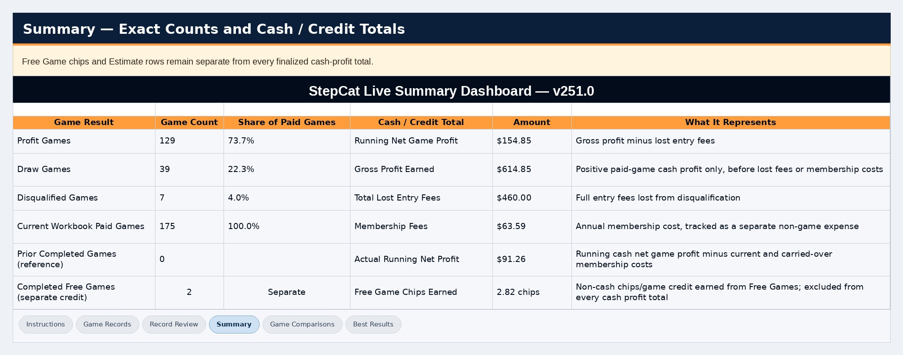
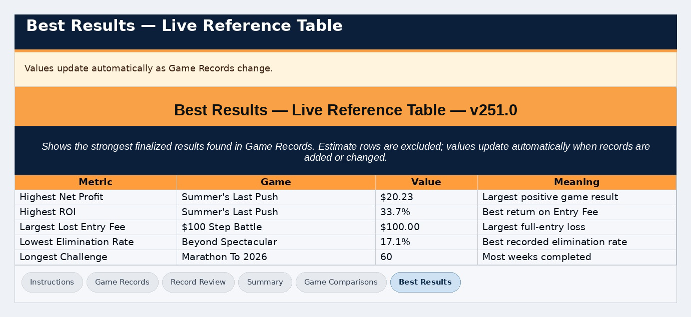

## Final review-focus and navigation polish — August 25, 2026

- Guided Entry Back controls remain at the bottom beside Continue and now use the same neutral secondary-action treatment as Cancel; Continue remains the bright primary action and Clear Game Entry remains a separate reset action.
- Saved History remains an independent drawer and intentionally does not receive a Guided Entry Back button.
- After Continue to Review, Guided Step 3 collapses and dims as a completed group so the Step 4 Review panel becomes the clear visual focus; Edit or Continue Editing restores the selected Step 3 subsection.
- Saved History Estimate / Finalized / Member / result labels are flatter status chips with reduced depth so they do not resemble tappable buttons.
- Guided Entry logic, two-decimal currency limits, and the Finalize Estimate Disqualified focus/restoration fixes remain unchanged.

# StepCat Calculator v253.1

StepCat is an independent, mobile-first calculator and recordkeeping tool for step-challenge payout tracking. It can create payout estimates, record official completed results, keep device-local Saved History, and prepare exact workbook input rows for the matching profitability workbook.

**Current recommended release:** StepCat Calculator v253.1 + Workbook v253.2, dated **August 23, 2026**.

[Open Workbook v253.2 in Google Sheets](https://docs.google.com/spreadsheets/d/1j_fCeKQaxwhfP6M4TS9dHyIpHRgV9t521mUsNBe0M7o/edit?usp=drivesdk)

[Open the live StepCat web app](https://stepcat.netlify.app/)

> **Independent project:** StepCat is not officially affiliated with, endorsed by, or sponsored by any step-challenge platform.

## Workbook v253.2 finalization

Workbook v253.2 is the current public workbook paired with the unchanged StepCat Calculator v253.1. It keeps the v253.1 reporting, mobile row-insertion workflow, shorter special-record labels, alignment refinements, 500-record active boundary, and August 11 formula safeguards.

The v253.2 finalization corrects the remaining presentation inconsistencies without changing the profitability logic:

- **Record Review:** rows 5-25 use consistent row sizing.
- **Best Results:** rows 11, 12, and 15 use consistent row sizing.
- **Calculator unchanged:** StepCat remains v253.1; no calculator, Saved History, validation, or profitability math was changed for this workbook-only finalization.
- **Updating older workbooks:** open Workbook v253.2 and transfer **A5:M only through the last actual record row**. Do not copy N-Z or unused yellow rows below the final record. Carryover is not required merely to update workbook versions.

The workbook link above is the current public v253.2 file. Use **File -> Make a copy** in Google Sheets if you want your own editable Drive copy.

## What’s new in v253.1

The August 22 v253.1 release keeps the core profitability calculations unchanged while refining workbook use and reporting:

- **Mobile row insertion:** insert a whole worksheet row where a missing record belongs, enter or paste **A–M**, then remove the same number of unused blank rows immediately above the red boundary so it returns to row 505.
- **Cleaner record types:** the workbook uses **Free Game / Chips** and **Subscription / Membership Fee**, with more consistent numeric and `N/A` alignment.
- **Expanded Best Results:** reporting now includes meaningful high/low records for positive profit and ROI, elimination rate, challenge length, player fields, Gross Pot, and Free Game chips. A genuine 0% elimination rate can qualify.
- **Safer workbook updating:** an August 11 corrected v253.0 workbook may continue to be used if it is calculating normally. At the v253.1 release, older or problematic copies were moved to v253.1 by transferring **A5:M only through the last actual record row**. The current recommended workbook is v253.2.
- **Calculation safety retained:** the August 11 row/formula safeguards remain included; the core Game Records profitability formulas and Summary calculations are unchanged in v253.1.

The main page also uses a small **NEW** indicator on the collapsed **What’s New** drawer when the current release has not yet been opened on that browser/device. Opening the drawer marks that release as read locally. The indicator does **not** change the release date.

## Four-step workflow

StepCat uses one clear four-step progression:

1. **Entry Mode** — choose **Estimate** or **Finalized**.
2. **Membership Type** — confirm **Member** or **Non-Member**.
3. **Game Entry** — complete the required fields. Step 3 contains the unnumbered **Game Details**, **Calculation Information**, and, for Finalized entries, **Final Result** subsections.
4. **Review, Calculate & Save** — review the complete entry, edit any subsection if necessary, then calculate and save one record.

Unavailable workflow sections remain visibly dimmed until their prerequisites are complete. Gold identifies the current action, green identifies completed work, brown identifies locked/not-started areas, and red identifies something that requires correction. Every state is also written on screen; color is not the only identifier.

<em>Step 1 begins the current four-step workflow.</em>

<em>Membership Type becomes the current action after Entry Mode is confirmed.</em>

### Guided Sections or Show All Fields

Step 3 offers two layouts for the same fields:

- **Guided Sections** shows one compact subsection at a time. **Continue** is the only forward action; **Back** returns one subsection. Completed earlier sections dim and remain reopenable, while unreached future sections stay more strongly dimmed and locked until Continue reaches them.
- **Show All Fields** displays the complete Step 3 form for scrolling and hides the Guided Continue/Back controls.

Switching layouts does not clear entered values. A separate setting can remember the preferred layout.

Amount-entry fields in StepCat (Gross Pot, Entry Fee, Final Earned, and the Finalize Estimate amount) accept a maximum of two digits after the decimal. Additional decimal points or extra fractional digits are removed so currency-style entries cannot extend past cents.

## Estimate and Finalized modes

### Estimate

Use **Estimate** for a projection before the official completed result is available.

- **Member:** uses the full Gross Pot.
- **Non-Member:** uses 85% of Gross Pot after the 15% deduction.
- Gross Pot and Eligible Players drive the estimate.
- Estimate cards show projected earnings; finalized accounting Result and ROI remain `N/A` until the record is finalized.
- A below-fee Estimate still shows the exact projection and an estimated break-even point.

### Finalized

Use **Finalized** for a completed result.

- Enter the amount actually returned as **Final Earned / Chips**.
- Final Earned determines Profit or Draw accounting.
- If a paid entry was fully forfeited, select **Disqualified / Lost Entry Fee**; Final Earned becomes `$0.00`.
- Gross Pot and player counts can still be recorded as optional comparison information.

## Result rules

| Result | Rule |
| --- | --- |
| **Profit** | Final Earned is greater than Entry Fee; Net Profit is the difference. |
| **Draw** | A normal completed return is at or below Entry Fee; Net Profit is `$0.00`. |
| **Disqualified** | Final Earned is `$0.00`; a paid game loses the full Entry Fee. |
| **Free Game** | Return is chips/game credit; cash Net Profit is `$0.00` and ROI is `N/A`. Free Game records require a `$0` Entry Fee. |
| **Estimate** | Projection only; finalized accounting fields remain `N/A`. |

## Review, validation, and saving

**Review Entry** gathers the complete record before anything is saved. Each review group includes an **Edit** action that returns to the exact Step 3 subsection.

StepCat validates required values and common contradictions, including:

- Eligible and Total Players must be whole numbers.
- Eligible Players cannot exceed Total Players.
- End Date cannot be earlier than Start Date.
- Finalized entries require Final Earned unless Disqualified is selected.
- Free Game records require a `$0` Entry Fee.

After review, **Calculate & Save** creates one Saved History record.

<em>Review the complete entry before Calculate & Save creates a Saved History record.</em>

## Saved History

Saved History is stored locally in the current browser/device.

- Every record receives a stable, non-editable **SC-#### Record ID**.
- **Copy This Sheet Row** copies one exact workbook A–M row.
- **Copy All Sheet Rows** copies every saved A–M record.
- Individual Delete actions provide a brief Undo option.
- **Clear History** creates a dated local backup before clearing all cards.
- **Restore History** warns before replacing non-empty current history.
- Each Estimate card includes **Finalize This Estimate**, which updates the existing record in place and preserves its Record ID and chronological position.
- In the Finalize This Estimate dialog, **Disqualified / Lost Entry Fee is OFF by default and already means Not Disqualified**. Turn it on only for an actual disqualification; ON locks Final Earned at 0.00, and returning to OFF restores the previous Final Earned value or blank state.

When an Estimate is finalized, paste the finalized A–M row over the same game’s existing workbook A–M cells rather than adding a duplicate row.

### Local data vs. cross-device records

StepCat Saved History, settings, and unfinished fields **do not automatically synchronize** to another browser or device. Records already entered in the Google Sheet are available anywhere the same Google account can access that Sheet.

For long-term/cross-device recordkeeping, use the workbook as the permanent record.

## Profitability workbook

The matching v253.2 workbook is self-contained and can be used **with or without the calculator**.

To create the current workbook, open StepCat and use:

**Help & Resources → Guides & Workbook → Open Workbook v253.2 in Google Sheets**

### A–M are inputs; N–Z are formulas

- Enter or paste records only in **A–M**.
- Leave **N–Z** untouched so the workbook’s protected formulas can calculate results, review status, totals, and reports.
- **Copy This Sheet Row** and **Copy All Sheet Rows** already prepare the A–M values in workbook order.

<em>The workbook screenshots show the v253.1/v253.2 structure; the current public workbook is v253.2.</em>

### 500-record active area

The normal active record area contains **500 record positions**, usually rows **5–504**, with the red **ACTIVE RECORD BOUNDARY** at row 505.

If a missing record must be inserted between existing records on mobile:

1. Insert a whole worksheet row above the desired position.
2. Enter or paste **A–M**.
3. The red boundary will move down temporarily.
4. Delete the same number of unused blank rows immediately above the red boundary so it returns to row 505.
5. **Never delete the red boundary itself.**

Carryover is for starting a fresh workbook after all 500 active record positions are actually filled; it is **not** required merely to update workbook versions.

## Reports

The workbook includes Summary, Game Comparisons, Best Results, and Record Review reporting.

- **Games by Result** counts Profit, Draw, and Disqualified completed paid games exactly.
- **Subscription / Membership Fee** rows are excluded from Games by Result and tracked separately.
- **Actual Running Net Profit** subtracts those non-game costs from Net Game Profit.
- **Best Results** includes positive-profit/ROI extremes, elimination-rate extremes, challenge length, player fields, Gross Pot, and Free Game chips.
- **Record Review** flags issues such as a Free Game row carrying a non-zero Entry Fee.

<em>Record Review in Workbook v253.2 with rows 5–30 shown at consistent sizing.</em>

<em>Best Results in Workbook v253.2 with the finalized row-height consistency.</em>

## Updating an older workbook

**Workbook v253.2 is recommended as of August 23, 2026.** An August 11 corrected v253.0 workbook may continue to perform the core calculations if it is working normally.

Updating is strongly recommended if the existing copy predates the August 11 corrections, shows formula/reference problems, or you want the finalized v253.2 workbook presentation and the v253.1 reporting/mobile-workflow refinements.

When moving existing records:

1. Keep the older workbook as a backup.
2. Open the current Workbook v253.2 link from StepCat and make your own Google Sheets copy if desired.
3. Copy **A5:M only through the last actual record row**. Example: if row 198 is the last record, copy `A5:M198`.
4. Include blank rows that occur **between existing records** so order is preserved, but do not copy unused yellow rows below the last record down to the red boundary.
5. On a computer, use **Paste special → Values only** into `A5`.
6. On a phone/tablet, regular Paste is acceptable when only A–M are selected.
7. Do **not** copy N–Z, headers, whole rows, whole sheets, reports, or charts.
8. Verify the first and last records, record count, Summary, Record Review, and Best Results.

## Settings and Help

Settings save automatically and include controls for:

- visible sections and startup state;
- remembering Estimate / Finalized Mode;
- remembering Guided Sections / Show All Fields;
- remembering Membership Type and Payment / Record Type;
- unfinished-entry recovery;
- the `$0` Entry Fee confirmation safeguard;
- Help/guide section memory;
- haptic feedback;
- installation-prompt visibility.

**Restore Defaults** resets saved preferences to StepCat’s original settings, including Low haptic feedback. It does **not** delete Saved History, current entry information, or spreadsheet records.

Help & Resources includes Quick Explanations, result rules, estimate guidance, Spreadsheet Copy Instructions, workbook guidance, installation/shortcut help, downloadable guides, and feedback.

## Installation and offline use

StepCat can offer app-like installation when the browser/device supports it. The Install StepCat card reports whether installation is available, and **Don’t Show Again** saves that preference on the current browser/device. **Show Installation Prompt** in Settings restores it.

After StepCat has been installed while online, the calculator, Saved History, Settings, Help, and cached guides can load from the device. Internet access is still required for:

- installation and updates;
- Google Sheets;
- file downloads;
- feedback email;
- external links.

When online, the browser may briefly check for an updated StepCat version.

## Guides and documentation

- [Quick Start Guide — browser version](quick-start-guide.html)
- [Full Documentation — browser version](standalone.html)
- [Quick Start Guide — PDF](StepCat_Quick_Start_Guide_v253.2.pdf)
- [Quick Start Guide — editable DOCX](StepCat_Quick_Start_Guide_v253.2.docx)

The browser guides describe the current StepCat Calculator v253.1 + Workbook v253.2 workflow and use the screenshots in the repository `images/` folder.

## Repository files

Core public files include:

- `index.html` — current StepCat calculator.
- `README.md` — this project overview.
- `manifest.json` — installable-web-app metadata.
- `service-worker.js` — caching/offline/update behavior.
- `quick-start-guide.html` — illustrated Quick Start Guide.
- `standalone.html` — Full Documentation.
- `StepCat_Quick_Start_Guide_v253.2.pdf` — printable guide.
- `StepCat_Quick_Start_Guide_v253.2.docx` — editable guide.
- `StepCat_Public_Blank_Profitability_Analysis_v253.2.xlsx` — current public blank workbook for download/GitHub; the website opens the same public v253.2 file in Google Sheets.
- `images/` — current guide/documentation screenshots.
- StepCat favicon, touch-icon, and installable-app icon files.

The current website action is **Open Workbook v253.2 in Google Sheets** inside StepCat Help & Resources. It opens the public v253.2 workbook; use **File → Make a copy** in Google Sheets for an editable personal copy.

## Release notes and maintenance

The public README is intended to describe the **current supported release**, not serve as an accumulated internal revision log. Development revision notes, temporary QA instructions, and superseded implementation details should remain outside the public README unless they are necessary for users of the current release.

## About

StepCat is designed to make payout estimates, finalized-result recording, workbook transfer, and profitability tracking easier while keeping the user in control of the permanent spreadsheet record.

For confirmed accounting, the official completed game result should always be treated as authoritative.

### August 25, 2026 — Finalize toggle visual parity
The **Finalize This Estimate → Disqualified / Lost Entry Fee** switch now intentionally matches the Settings switches in both OFF and ON states. Returning it to OFF removes the ON glow completely.

FINALIZE DISQUALIFICATION TOGGLE — EXACT SETTINGS MATCH (AUGUST 25, 2026)
- The Finalize This Estimate Disqualified switch now inherits the same checkbox visual rules used by Settings rather than duplicating them.
- The modal editable-field focus rule explicitly excludes checkbox inputs, preventing OFF from appearing white/lit after the switch receives focus.
- OFF before touch and OFF after ON -> OFF are visually identical to a Settings toggle in its OFF state.
- ON is visually identical to a Settings toggle in its ON state. Functional Final Earned restoration behavior is unchanged.

## Finalize Estimate toggle focus-parity correction — August 25, 2026
The Finalize This Estimate Disqualified toggle now retains the exact Settings-style OFF/ON colors even while the checkbox has browser focus. This prevents the OFF state from remaining pale/white after ON → OFF. Functional Final Earned restoration behavior is unchanged.
