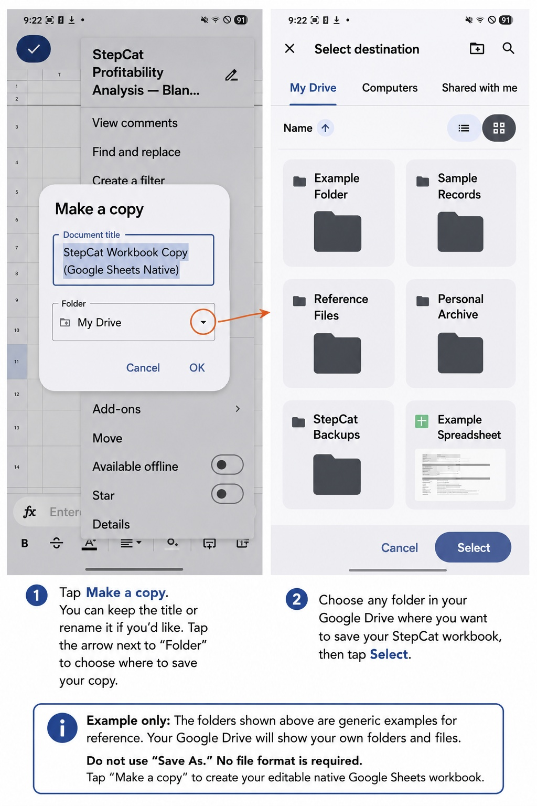

# StepCat Calculator v250

StepCat is a mobile-first payout calculator and recordkeeping tool for projected and finalized challenge results. It supports Member and Non-Member calculations, Saved History, workbook-ready A–M row copying, Free Games, disqualified records, Notes, PWA installation, and the six-sheet Profitability Analysis workbook.

## Quick workflow

1. Choose **Estimate** or **Finalized**.
2. Confirm **Member** or **Non-Member**.
3. Enter the record and calculation details.
4. Tap **Calculate & Save**.
5. Tap **Copy This Sheet Row** and paste into the first empty **Game Records** cell in column A.

## Illustrated app workflow

<table>
<tr>
<td align="center" width="50%"> <strong>Game and record information</strong></td>
<td align="center" width="50%"> <strong>Completed record details</strong></td>
</tr>
<tr>
<td align="center"> <strong>Confirm Member or Non-Member</strong></td>
<td align="center"> <strong>Enter calculation information</strong></td>
</tr>
<tr>
<td align="center"> <strong>Final Earned is required in Finalized mode</strong></td>
<td align="center"> <strong>Enter the official Final Earned amount</strong></td>
</tr>
<tr>
<td align="center"> <strong>Use Notes for cash-and-points details</strong></td>
<td align="center"> <strong>Calculate and save the record</strong></td>
</tr>
<tr>
<td align="center"> <strong>Newest Saved History result</strong></td>
<td align="center"> <strong>Full Saved History card</strong></td>
</tr>
<tr>
<td align="center"> <strong>Copy the workbook row</strong></td>
<td align="center"> <strong>Sheet row copied</strong></td>
</tr>
</table>

## Google Sheets Workbook

[**Make a StepCat Google Sheets Copy**](https://docs.google.com/spreadsheets/d/1STrfkd-GI7LL8BBIaPv6v3YtSv4oQKqP8LL_GvDmTj4/copy)

On mobile, choose **Make a copy**. Do not choose **Save As**—no file format is required. My Drive is the default destination; users may choose another Drive folder before tapping **OK**. If Google asks which account to use, select the account where the copy should be stored. Each user sees only accounts already signed in on their own device. If the template opens in the Sheets app rather than showing the copy prompt, use the three-dot menu and choose **Make a copy**.

*Privacy-safe example: the visible folders and files are generic placeholders. Each user sees their own Google Drive content.*

A free Google account is required to save a copy. The Google Sheets app is recommended for convenient mobile editing. Browser use may also work but is less convenient; the Google Drive app is optional.

## Workbook workflow

 <strong>Workbook instructions and entry guidance</strong>

 <strong>Compact frozen headings in Game Records</strong>

 <strong>Frozen headings remain visible while scrolling</strong>

 <strong>Formula columns N–Z calculate automatically</strong>

 <strong>Record Review checks fields and summarizes results</strong>

## Workbook status

The workbook distinguishes:

- **Free Game — completed challenge/chips**
- **Subscription — membership charge only**

Rows **1–4** in Game Records remain compact and frozen. Enter or paste only in **A–M**. Formula columns **N–Z** calculate automatically and should not be overwritten. Record Review includes a totals panel at the right. The public workbook is now a **native Google Sheet**. Insert a row above or below from inside the Game Records table and Google Sheets automatically extends formulas, dropdowns, formatting, and visible cell borders.

Summary and Game Comparisons use numerical tables rather than charts for easier mobile viewing and exact verification.

## v250 workbook insertion and missing-value update — July 27, 2026

v250 updates the workbook and its instructions so direct spreadsheet entry is safer and clearer:

- **Free Games:** Adjusted Pot / Chips and Estimated Earned / Chips display `N/A` when the values required for an estimate are unavailable.
- **Disqualified records:** existing disqualified games display `$0.00` in Final Earned / Chips instead of appearing incomplete.
- **Forgotten games in Google Sheets:** select a cell inside Game Records near the correct chronological position, then insert a row above or below. Enter or paste A–M; N–Z are created automatically.
- **Formula check:** Record Review flags a populated row if an N–Z formula is missing. Undo and reinsert the row from inside the table if this occurs.
- **Direct spreadsheet updates:** later changes made in A–M recalculate the record when its N–Z formulas are intact.

The public workbook is distributed through a Google Sheets copy link rather than an Excel download. Each user receives an independent native Google Sheet in their own Google account. The private Personal Master is never included in the public repository.

## Migration requirements

Migration to v250 is recommended to adopt native Google Sheets table-row insertion, Free Game N/A safeguards, visible $0.00 disqualification values, missing-formula warnings, and the finalized frozen-row layout.

First compare the older workbook’s **A–M headers** with v250. When the order matches, copy only populated **Game Records A–M** cells. Paste values only into **A5** of a new unused v250 copy, or into the next available A–M row if the v250 copy already contains records. Do not copy whole sheets, headers, Record Review, or formula columns **N–Z**. Keep the older workbook as a backup until records and totals are verified.

### Feedback workflow screenshots

<table>
<tr>
<td align="center" width="50%"> <strong>Enter a question, issue, or suggestion</strong></td>
<td align="center" width="50%"> <strong>Email opens with the message prepared</strong></td>
</tr>
</table>

Open **Help (?)**, scroll to **Guides & Downloads**, and tap **Write Feedback**. The dialog opens over Help. After the email app opens, send the prepared message and return or swipe back to StepCat. The addresses shown above are generic examples; no feedback email address is stored in the workbook.

## Guides, downloads, and feedback

- [Illustrated Quick Start Guide — HTML](quick-start-guide.html)
- [Illustrated Quick Start Guide — PDF](StepCat_Quick_Start_Guide_v250.pdf)
- [Editable Quick Start Guide — DOCX](StepCat_Quick_Start_Guide_v250.docx)
- [Fully Illustrated Full Documentation](standalone.html)

To send feedback from StepCat, open **Help (?)**, scroll to **Guides & Downloads**, and tap **Write Feedback**. The form opens over Help; StepCat copies the message and opens the device's email app with the recipient and subject prepared.

## Public files

- `index.html` — StepCat webpage
- `service-worker.js` — offline cache
- [Make a StepCat Google Sheets Copy](https://docs.google.com/spreadsheets/d/1STrfkd-GI7LL8BBIaPv6v3YtSv4oQKqP8LL_GvDmTj4/copy) — public native workbook
- `README.md` — repository overview and illustrated workflow
- `quick-start-guide.html` — illustrated browser Quick Start Guide
- `StepCat_Quick_Start_Guide_v250.pdf` — downloadable illustrated PDF
- `StepCat_Quick_Start_Guide_v250.docx` — editable downloadable guide
- `standalone.html` — fully illustrated full documentation with all 20 current screenshots
- `images/` — current app and workbook screenshots
- `UPLOAD_INSTRUCTIONS.txt` — replacement instructions

The Personal Master workbook is private and must not be uploaded to a public repository.
