# StepCat Calculator v145

StepCat is a mobile-first payout calculator and recordkeeping tool. It can project an estimated result before a game is complete and save the official posted result afterward.

<em>StepCat Calculator v145.</em>

## Video tutorial

A StepCat v145 video tutorial is available from the GitHub release:

[Watch or download the StepCat v145 video tutorial](https://github.com/gatorball345-ux/StepBet-Profit-Calculator-/releases/tag/v145-video-tutorial)

## Entry modes

### Estimate

Use **Estimate** before the official result is available.

- **Non-Member:** `(Gross Pot - (Gross Pot × 0.15)) ÷ Eligible Winners`
- **Member:** `Gross Pot ÷ Eligible Winners`
- **Total Players** is optional and only helps display the number of disqualified players.
- Estimate results are projections and may differ from the official posted amount.

### Finalized

Use **Finalized** after the official result is posted.

- Confirm the remembered **Game Type** for recordkeeping.
- Enter the **Entry Fee** and **Official Earned Amount**.
- The official amount determines Earned, Profit, ROI, and Result.
- If the full Entry Fee was forfeited, turn on **Disqualified / Lost Entry Fee** instead.
- Gross Pot and winner information do not control the finalized calculation.

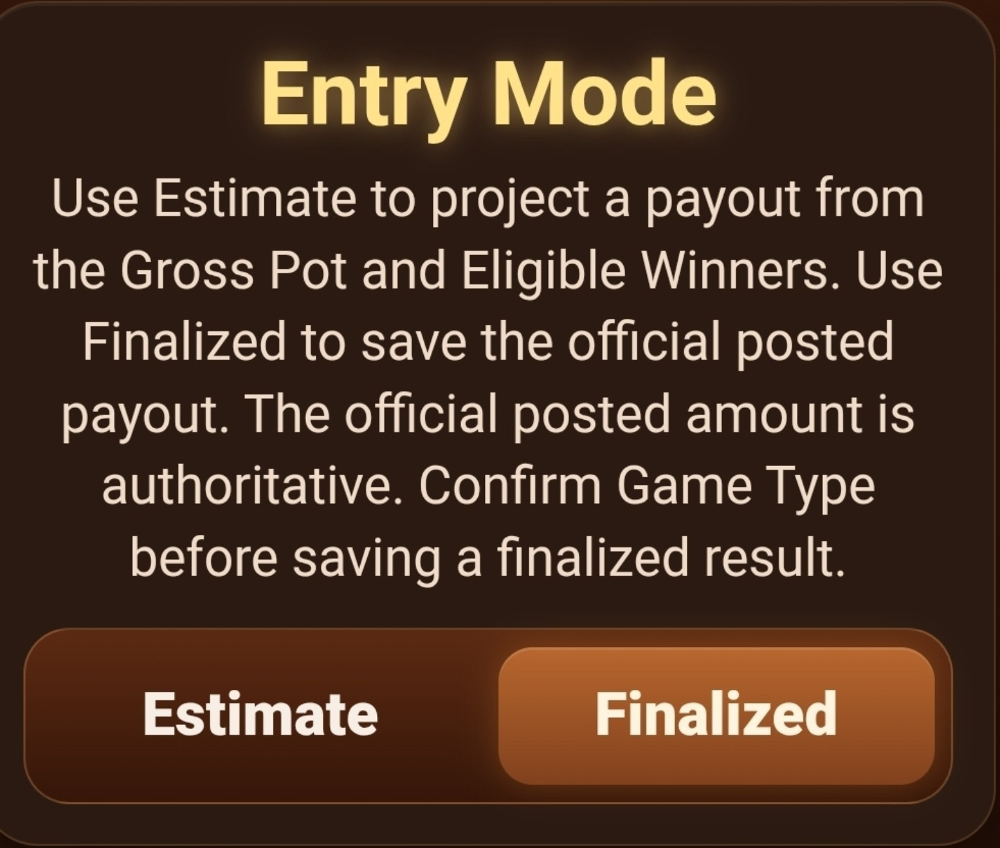

<em>Choose Estimate for projections or Finalized for confirmed records.</em>

## Estimate math

<table>
<tr>
<td align="center" width="50%">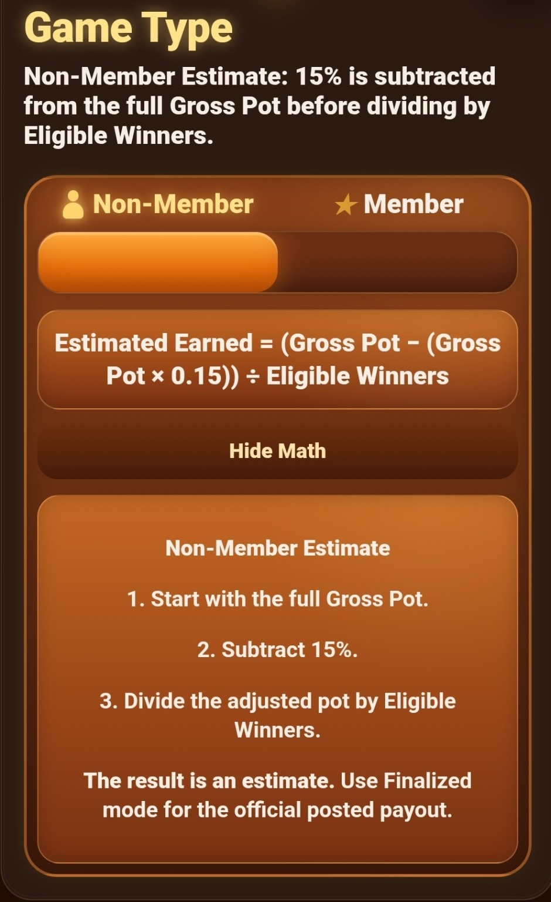 <em>Non-Member estimate math.</em></td>
<td align="center" width="50%">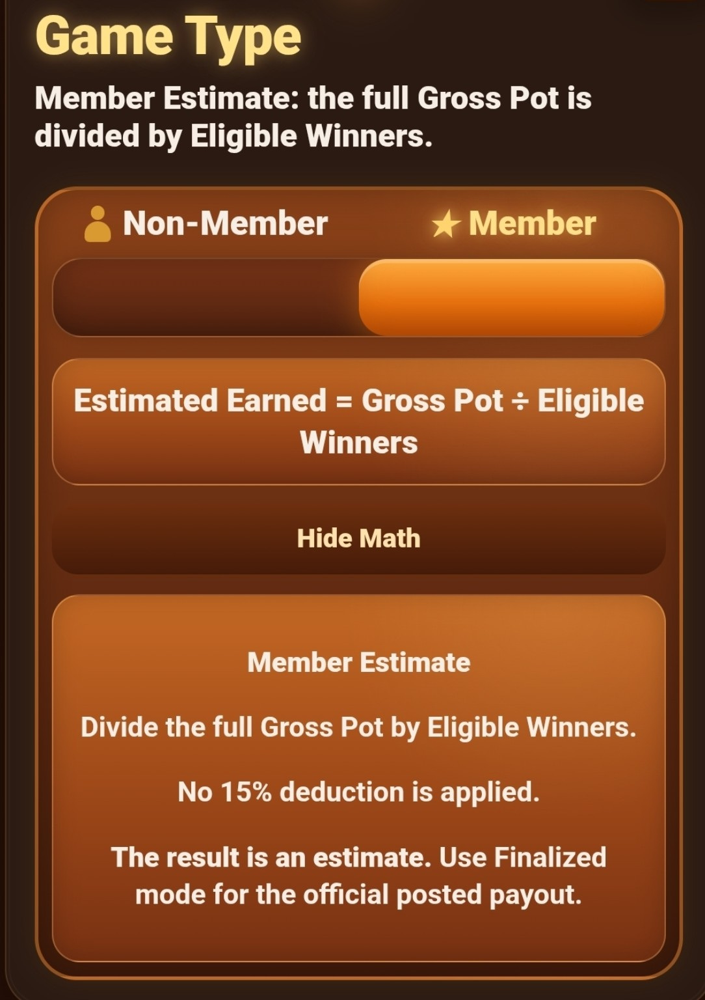 <em>Member estimate math.</em></td>
</tr>
</table>

## Enter game information

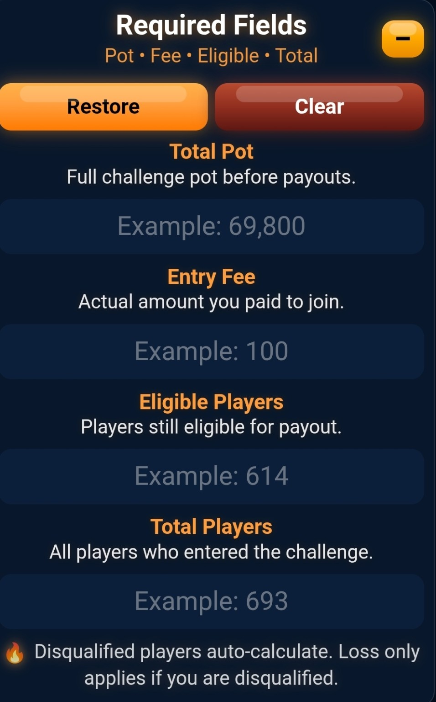

<em>Estimate requires Gross Pot, Entry Fee, and Eligible Winners. Total Players is optional.</em>

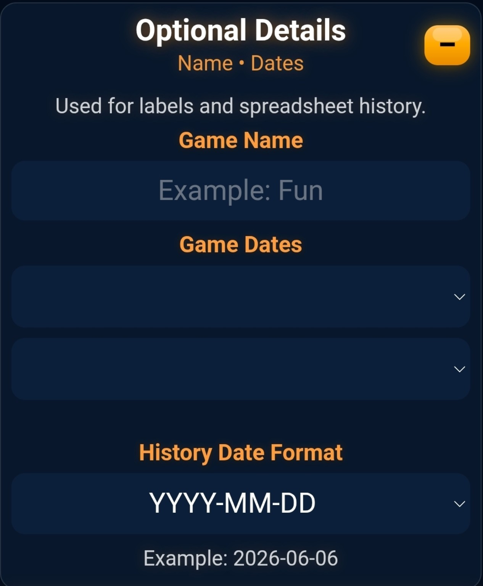

<em>Optional details include the game name, payment type, dates, date format, and disqualification status.</em>

## Finalized workflow

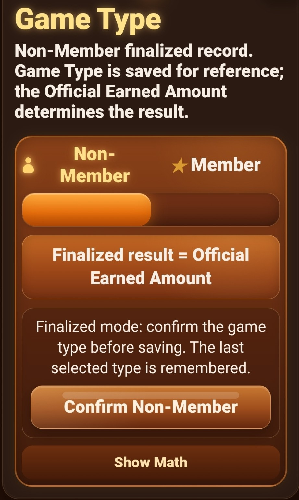

<em>Confirm the remembered Game Type before saving a finalized result.</em>

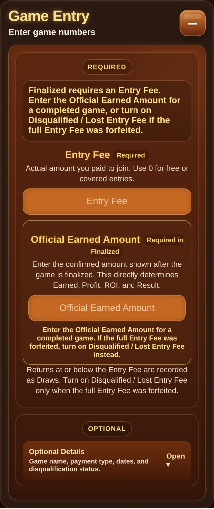

<em>Finalized mode records the Official Earned Amount or a forfeited-entry result.</em>

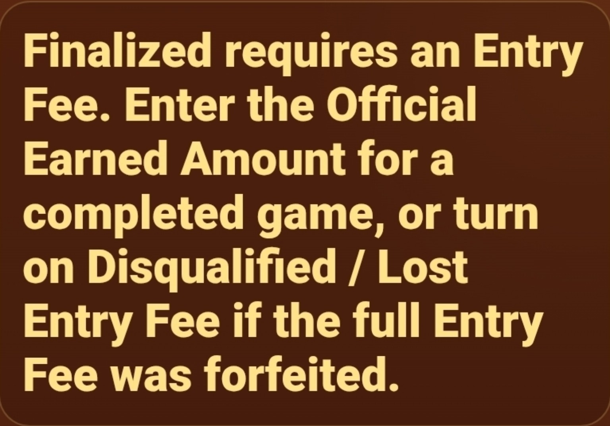

<em>Finalized requires an Entry Fee. Enter the Official Earned Amount for a completed game, or turn on Disqualified / Lost Entry Fee if the full Entry Fee was forfeited.</em>

## Calculate and save

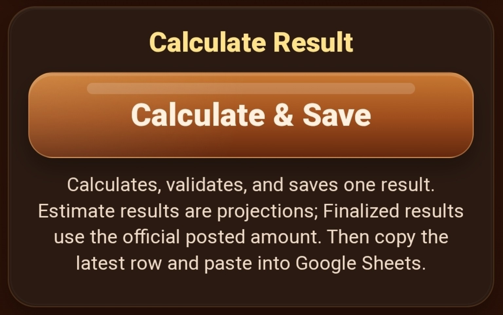

<em>Calculate, validate, and save one result.</em>

## Result examples

### Profit: Estimate and Finalized

<table>
<tr>
<td align="center" width="50%">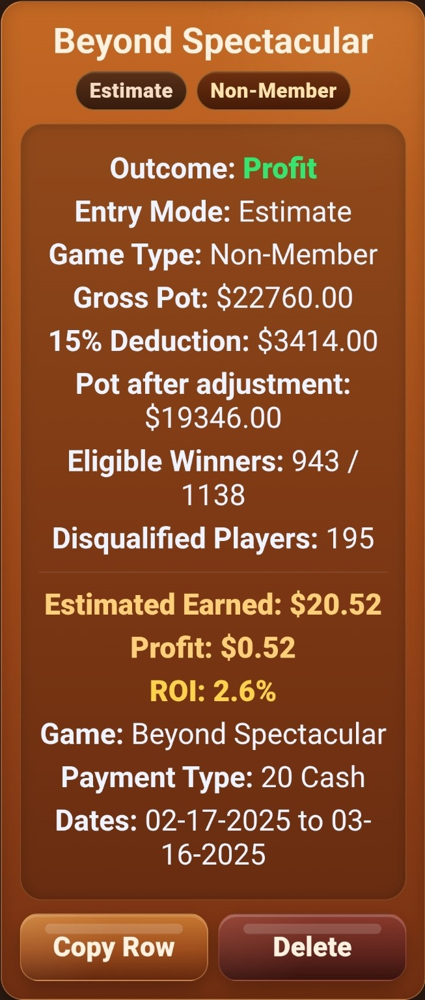 <em>Estimate: projected earned amount and profit.</em></td>
<td align="center" width="50%"> <em>Finalized: official posted earned amount and profit.</em></td>
</tr>
</table>

### Draw: Estimate and Finalized

<table>
<tr>
<td align="center" width="50%">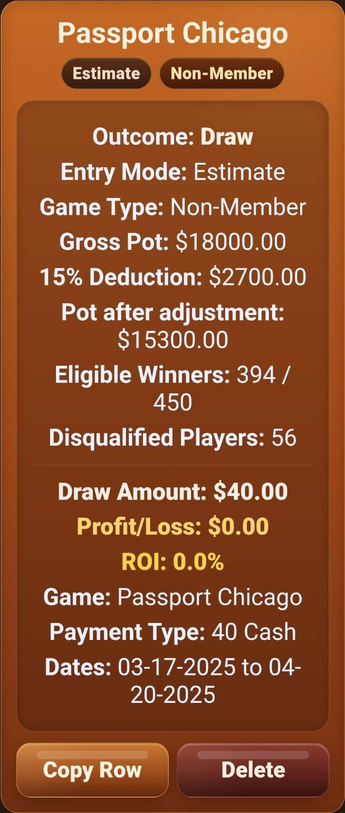 <em>Estimate Draw example.</em></td>
<td align="center" width="50%">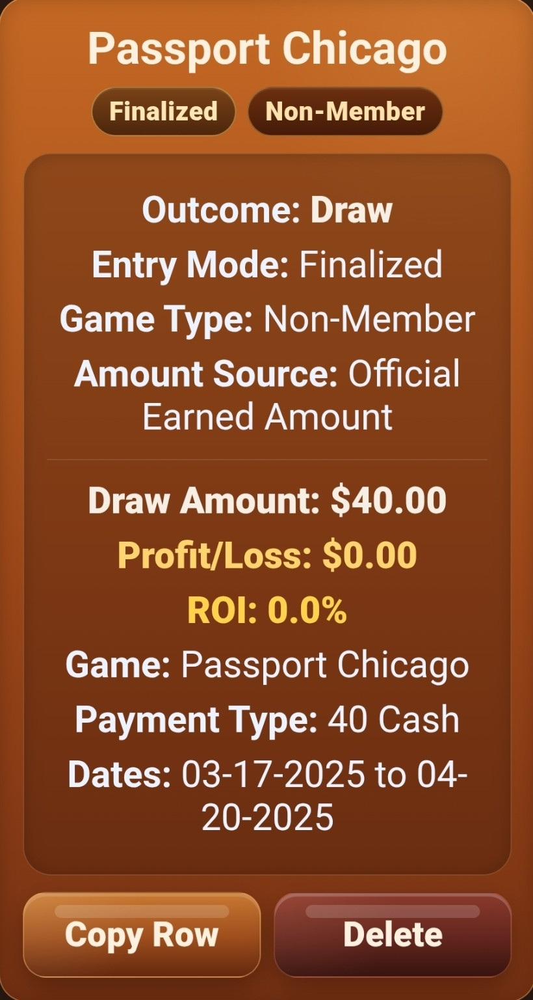 <em>Finalized Draw example.</em></td>
</tr>
</table>

### Result rules

- **Profit:** Earned is greater than Entry Fee.
- **Draw:** Earned is equal to or below Entry Fee. Draw records the Entry Fee as recouped, Profit/Loss is `$0.00`, and ROI is `0.0%`.
- **Disqualified:** Earned is `$0.00`, Lost equals Entry Fee, and ROI is `-100.0%` for a paid entry.

## Saved History and spreadsheet copying

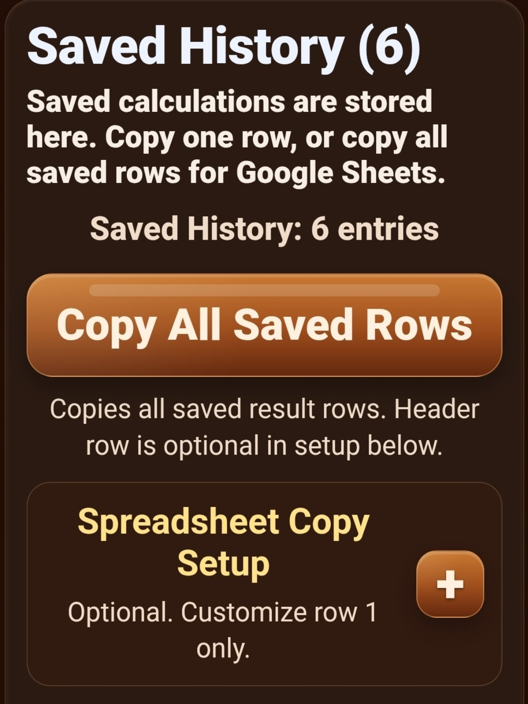

<em>Saved History count, Copy All Saved Rows, and Spreadsheet Copy Setup.</em>

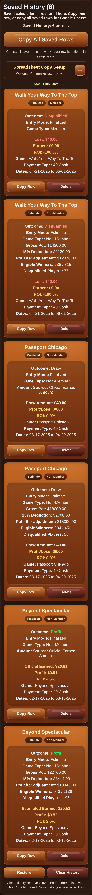

<em>Saved History can contain Estimate, Finalized, Profit, Draw, and Disqualified records.</em>

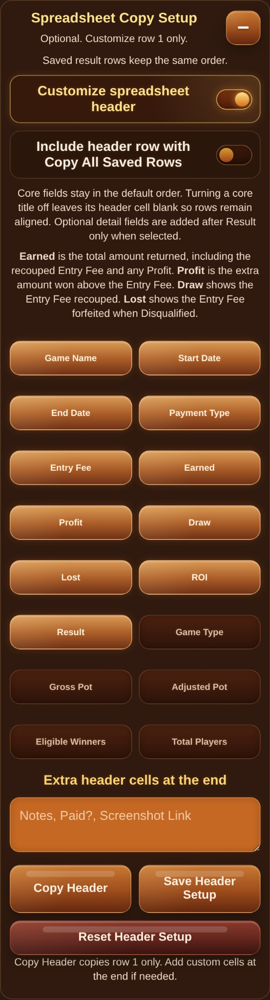

<em>Customize row 1 while keeping the fixed saved-row order aligned.</em>

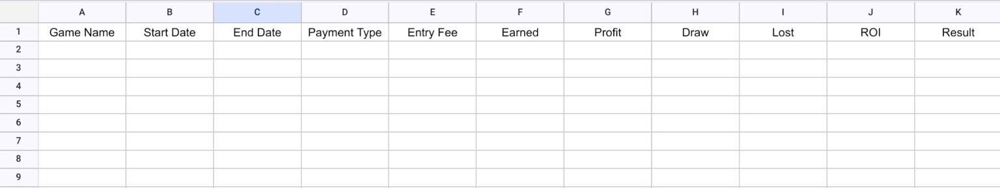

<em>Header row pasted into a spreadsheet.</em>

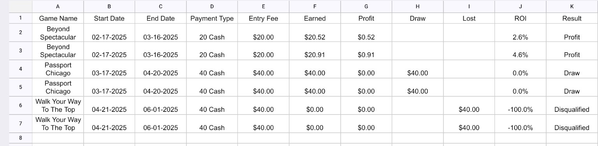

<em>Saved Estimate and Finalized rows pasted beneath the header.</em>

> **Spreadsheet note:** Formatting shown was added by the user after pasting. Repeated games are intentional Estimate/Finalized pairs, so amounts—especially Profit—may differ because Finalized uses the official posted amount.

The default spreadsheet order is:

1. Game Name
2. Start Date
3. End Date
4. Payment Type
5. Entry Fee
6. Earned
7. Profit
8. Draw
9. Lost
10. ROI
11. Result

Use **Copy Header** for row 1, **Copy Latest Row** for the newest result, **Copy Row** for a specific saved entry, or **Copy All Saved Rows** for the complete saved history.

### Which result should be pasted?

- The visible **Result Card** represents the newest saved calculation. **Copy Latest Row** copies that completed spreadsheet row.
- The matching card in **Saved History** contains the same completed values in the same column order. Its **Copy Row** button is useful when you need that particular saved result later.
- For normal ongoing use, copy only the newest result and paste it into the next empty spreadsheet row.
- Use **Copy All Saved Rows** for an initial import, a batch transfer, a backup, or rebuilding a sheet. Pasting the same full history into a sheet that already contains those games will create duplicate rows.
- Use the copy buttons rather than manually copying the visible text from the Result Card.

### Two safe ways to prevent duplicate spreadsheet rows

Choose the workflow that matches how you want to use Saved History.

**Complete-history workflow**

Keep every entry in StepCat as a local archive. After the first full-history transfer, add future games with **Copy Latest Row** or the individual **Copy Row** button. Do not repeatedly paste **Copy All Saved Rows** into a spreadsheet that already contains those entries.

**Transfer-queue workflow**

Use Saved History as a list of entries that still need to be transferred:

1. Tap **Copy All Saved Rows** and paste the rows into the spreadsheet.
2. Confirm that every row pasted into the correct columns and that no entry is missing.
3. Only after verifying the spreadsheet, delete each transferred entry individually from **Saved History**.
4. Leave untransferred entries in Saved History. The next full-history copy will then contain only the remaining entries.

> **Important:** Deleting an entry removes StepCat's local Saved History copy. It does not remove a row that was already pasted into the spreadsheet. Keep the entry in StepCat, or make another backup, when you want StepCat to remain your complete archive.

## Optional profitability analysis template

The blank analysis template is optional. It contains no personal game records and does not change StepCat v145.

[Download the blank profitability analysis template](https://stepcat.netlify.app/StepCat_Blank_Profitability_Analysis_Template.xlsx)

For the easiest setup:

1. In **Spreadsheet Copy Setup**, include **Game Type**, **Gross Pot**, **Adjusted Pot**, **Eligible Winners**, and **Total Players**.
2. Leave **Include header row** off when copying rows into the template because the template already contains its own headers.
3. Paste the copied StepCat row into **Game Records**, starting in cell **A5** for the first game and using the next empty row afterward.
4. Enter **Count Source**, **Confidence**, and **Notes** only when useful.

### What is already calculated before you paste?

StepCat supplies the completed record values that belong in columns A through P.

- For an **Estimate**, StepCat calculates the **Adjusted Pot**, estimated **Earned** amount, Profit or Draw outcome, ROI, and Result before the row is copied.
- For a **Finalized** record, the Official Earned Amount is authoritative, and StepCat supplies Earned, Profit, Draw/Lost, ROI, and Result from that official amount.
- The profitability template stores those copied StepCat values. It does **not** independently recalculate Adjusted Pot from Gross Pot.

### What does the template calculate?

The template calculates the blue analysis fields **Challenge Length**, **Net Profit**, **Eliminated Players**, and **Elimination Rate**. Its summary and comparison areas update from the completed game rows. Profit is recorded when a challenge ends; the template does not calculate or describe weekly payouts.

- **Count Source:** Reported, Estimated, or Partly Estimated.
- **Confidence:** High, Medium, or Low for estimated player counts.
- **Notes:** Optional explanation of an estimate or unusual result.

## Settings

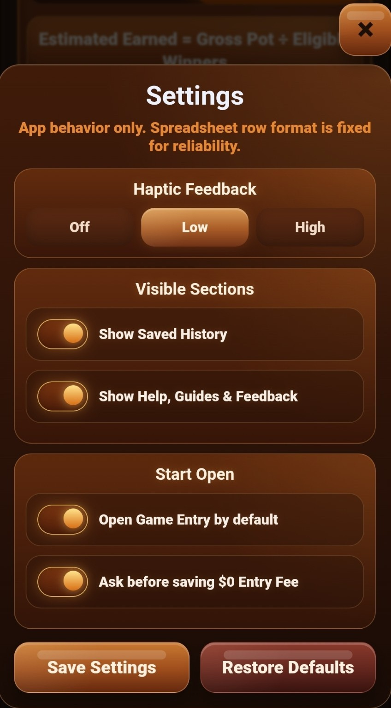

<em>Settings control haptics, visible sections, startup behavior, and the $0 Entry Fee prompt.</em>

## Help, guides, and feedback

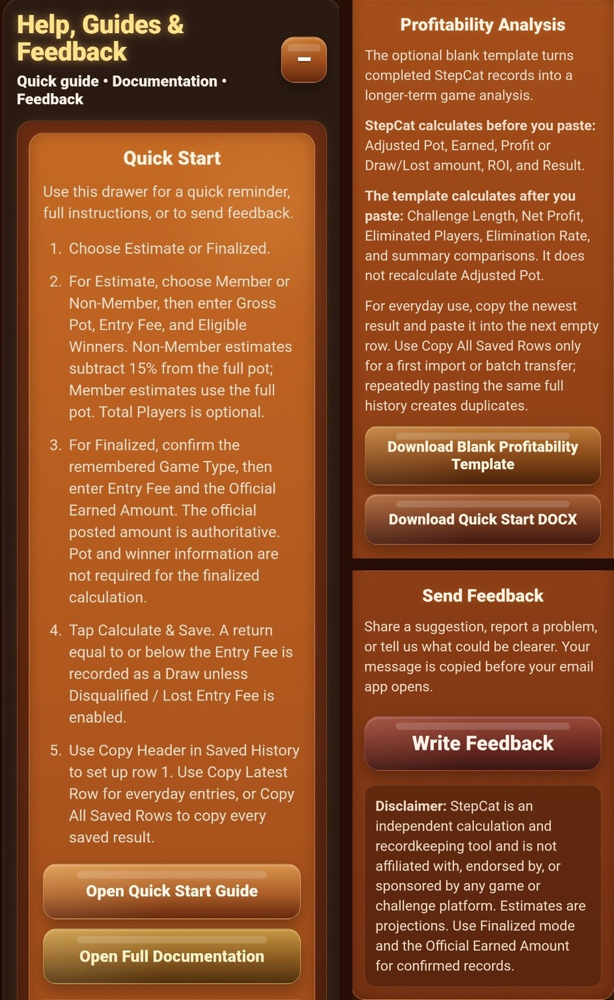

<em>Overview of the current Help drawer, including Quick Start, the video tutorial, profitability resources, feedback, and the disclaimer.</em>

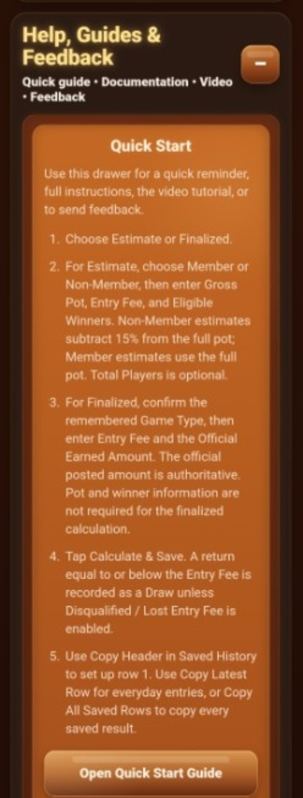

<em>Quick Start instructions and the browser-friendly guide links.</em>

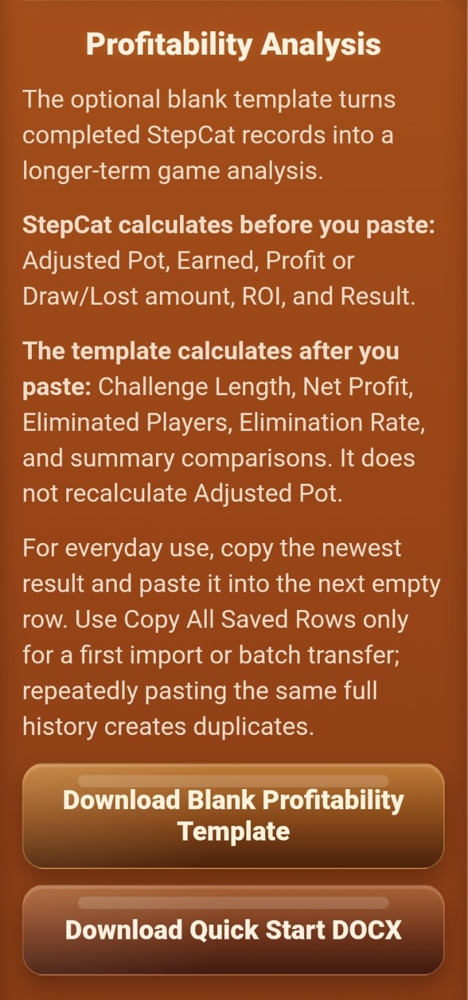

<em>Profitability Analysis guidance, blank-template download, and DOCX download.</em>

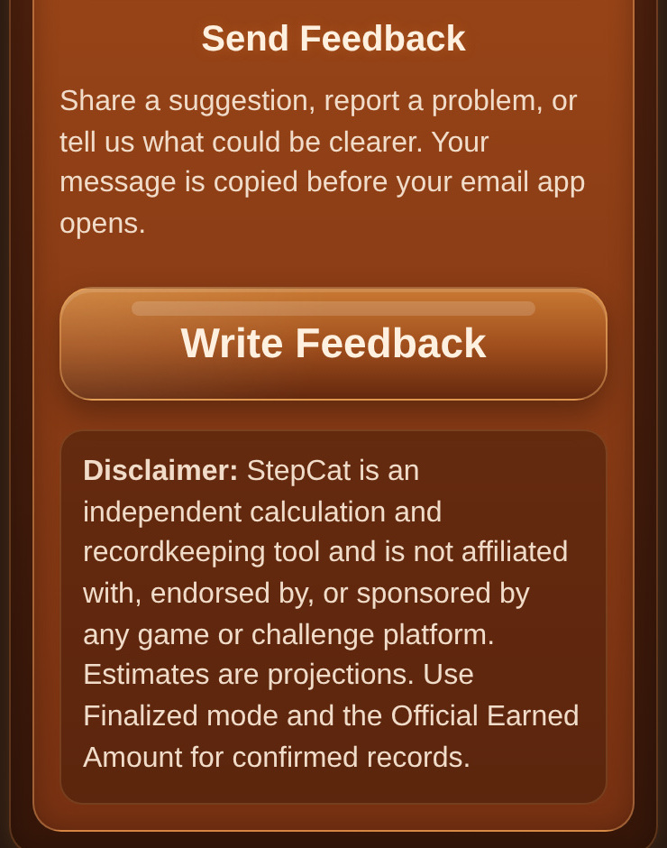

<em>Feedback control and the independent-project disclaimer.</em>

## Sending feedback

Tap **Write Feedback**, enter your message, and then tap **Send Feedback**. StepCat opens your device's default email app with the subject and message prepared. If no default email app is selected, your device may ask which app to use. Review the email and send it manually; StepCat does not send feedback automatically.

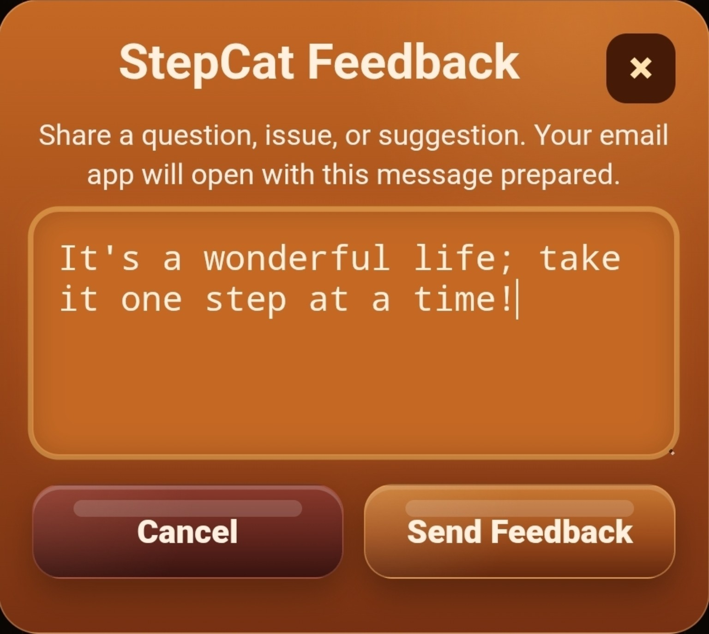

<em>Enter a message, then tap Send Feedback.</em>

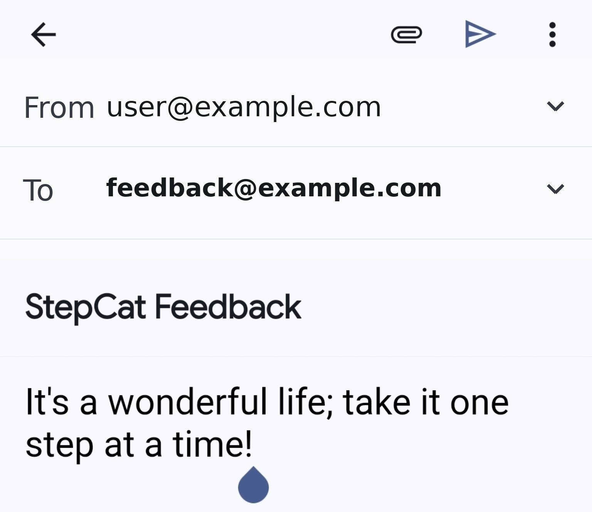

<em>The default email app opens with the subject and message prepared. The addresses shown are generic examples.</em>

## Storage and privacy

Saved History, current inputs, and preferences are stored locally in the browser on the current device. Clearing browser or site data can remove locally stored records. Copy important rows before clearing browser data. Verify spreadsheet transfers before deleting individual Saved History entries.

## Repository files

Keep these public files in the repository root:

- `index.html` — the current StepCat v145 app.
- `README.md` — this documentation.
- `quick-start-guide.html` — the online visual guide.
- `StepCat_Quick_Start_Guide_v145.docx` — the printable Word guide.
- `standalone.html` — the self-contained offline guide.
- `StepCat_Blank_Profitability_Analysis_Template.xlsx` — the optional blank analysis template.
- `images/` — screenshots used by the guide and README.

## Disclaimer

StepCat is an independent calculation and recordkeeping tool. It is not affiliated with, endorsed by, or sponsored by any game or challenge platform. Estimates are projections. Use Finalized mode and the Official Earned Amount for confirmed records.
