# StepCat Calculator v246.3.6

StepCat is a mobile-first payout calculator and recordkeeping tool for projected and finalized challenge results. It supports Member and Non-Member calculations, Saved History, workbook-ready A–M row copying, Free Games, disqualified records, Notes, PWA installation, and the six-sheet Profitability Analysis workbook.

## Quick workflow

1. Choose **Estimate** or **Finalized**.
2. Confirm **Member** or **Non-Member**.
3. Enter the record and calculation details.
4. Tap **Calculate & Save**.
5. Tap **Copy This Sheet Row** and paste into the first empty **Game Records** cell in column A.

## Illustrated app workflow

<table>
<tr>
<td align="center" width="50%">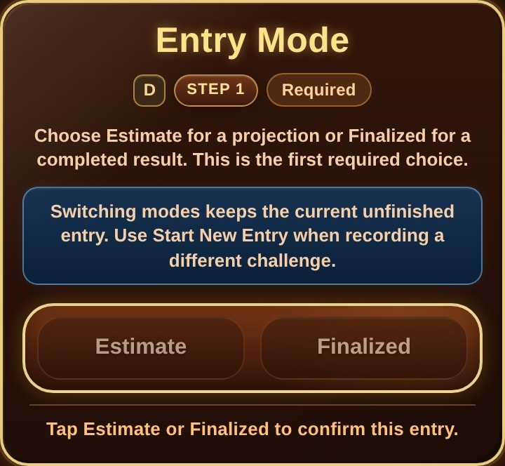 <strong>Game and record information</strong></td>
<td align="center" width="50%">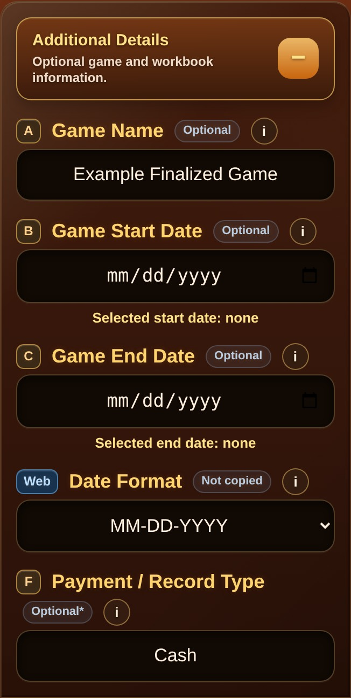 <strong>Completed record details</strong></td>
</tr>
<tr>
<td align="center"> <strong>Confirm Member or Non-Member</strong></td>
<td align="center">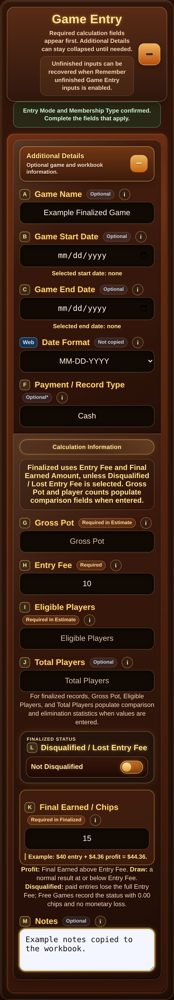 <strong>Enter calculation information</strong></td>
</tr>
<tr>
<td align="center"> <strong>Final Earned is required in Finalized mode</strong></td>
<td align="center">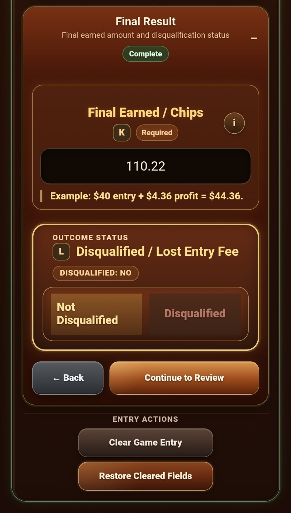 <strong>Enter the official Final Earned amount</strong></td>
</tr>
<tr>
<td align="center">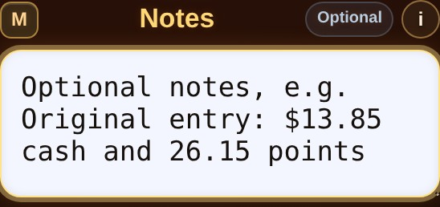 <strong>Use Notes for cash-and-points details</strong></td>
<td align="center">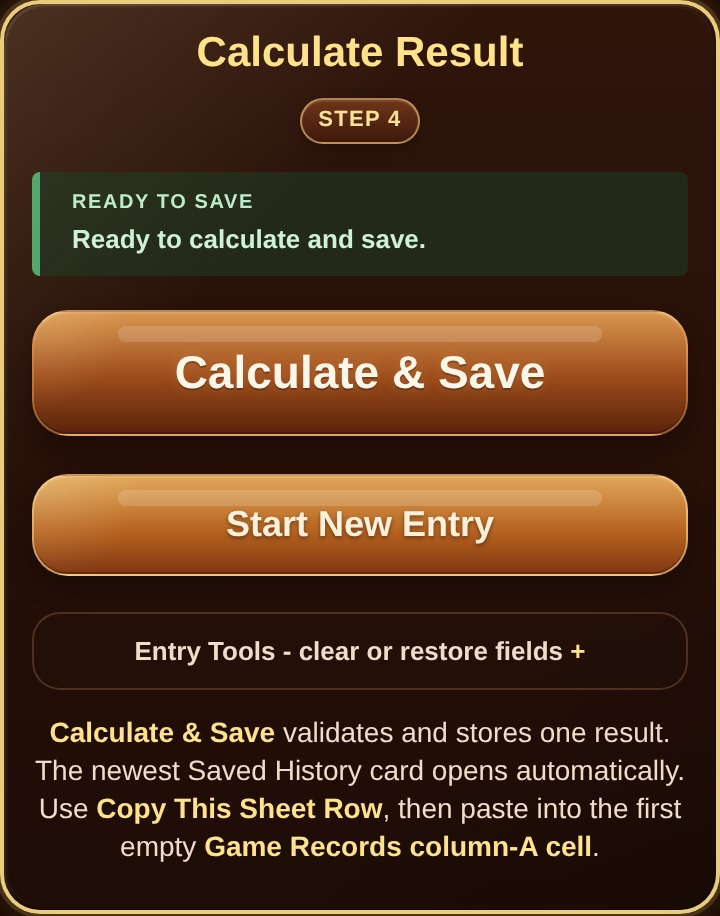 <strong>Calculate and save the record</strong></td>
</tr>
<tr>
<td align="center">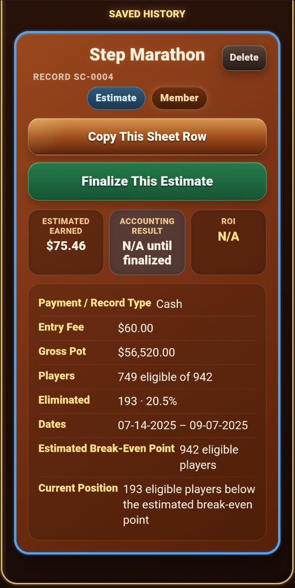 <strong>Newest Saved History result</strong></td>
<td align="center">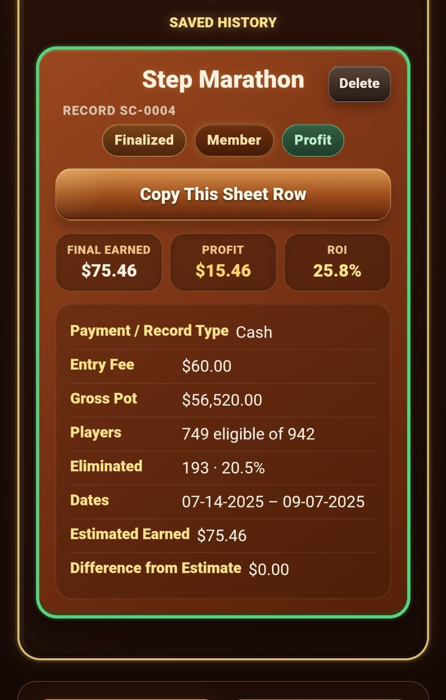 <strong>Full Saved History card</strong></td>
</tr>
<tr>
<td align="center">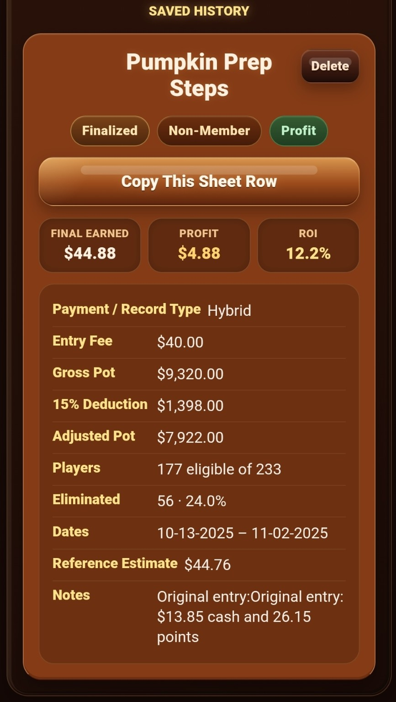 <strong>Copy the workbook row</strong></td>
<td align="center">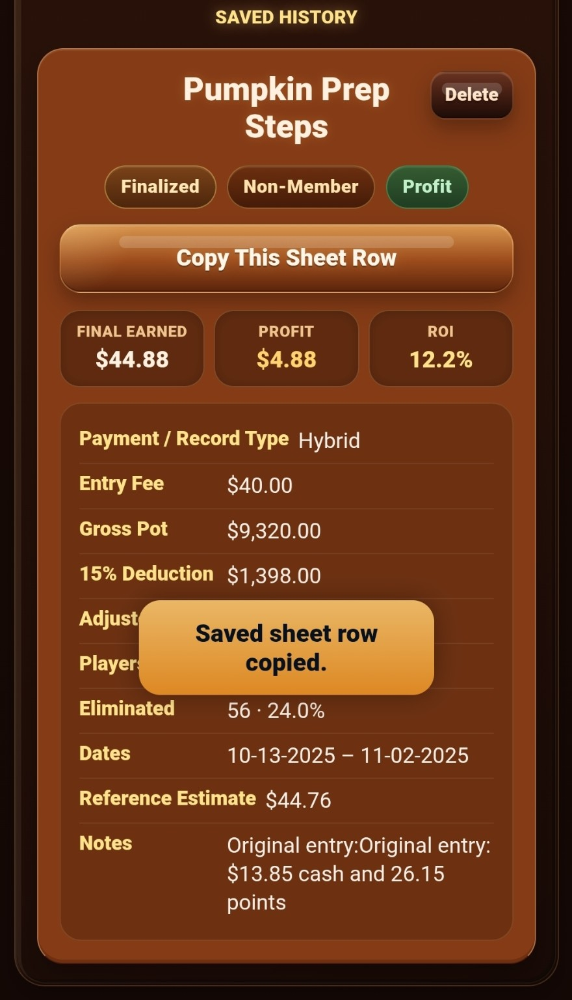 <strong>Sheet row copied</strong></td>
</tr>
</table>

## Workbook workflow

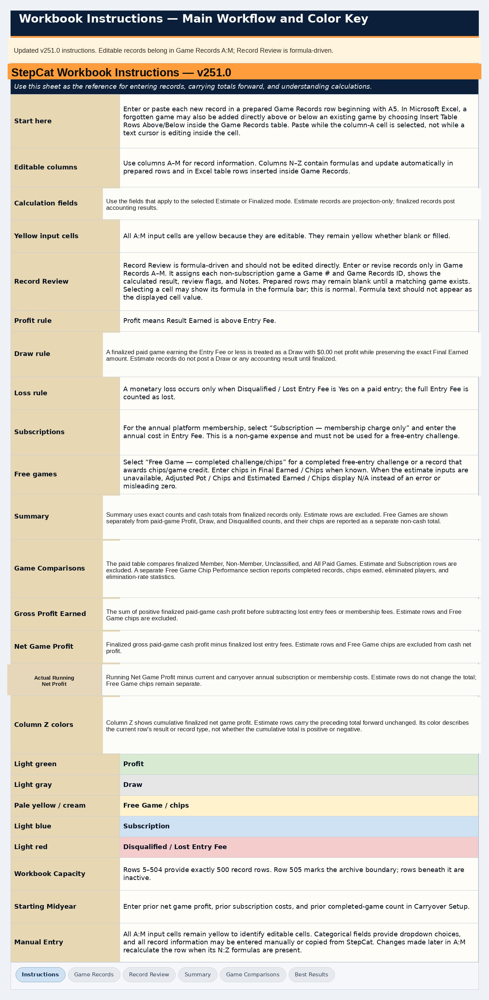 <strong>Workbook instructions and entry guidance</strong>

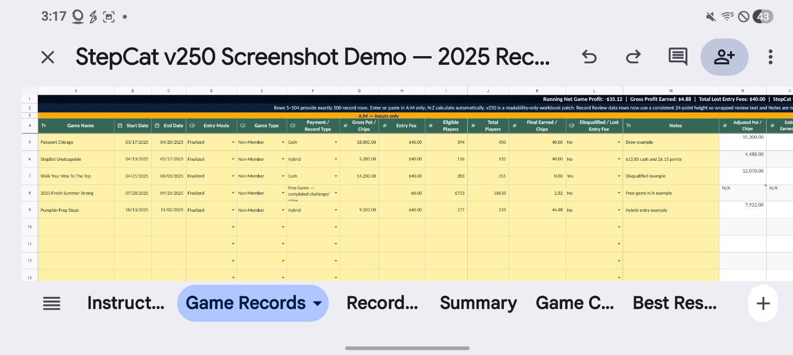 <strong>Compact frozen headings in Game Records</strong>

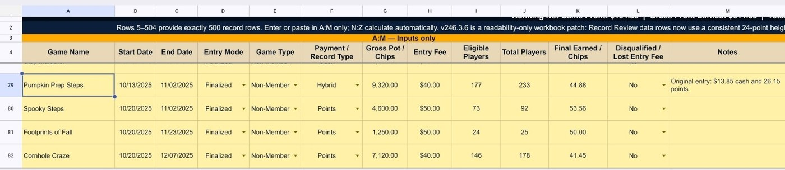 <strong>Frozen headings remain visible while scrolling</strong>

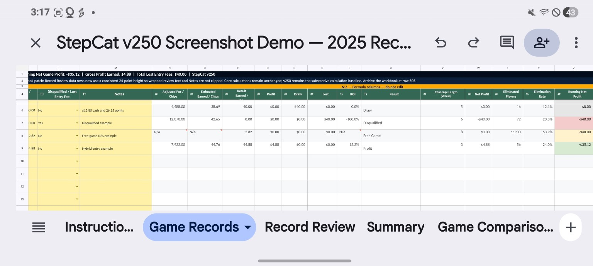 <strong>Formula columns N–Z calculate automatically</strong>

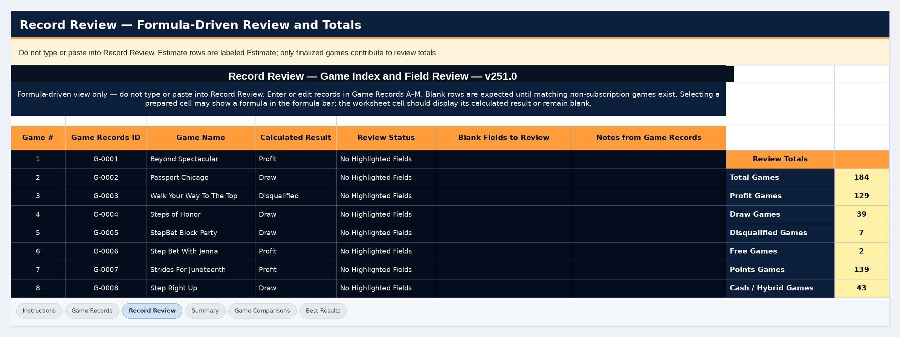 <strong>Record Review checks fields and summarizes results</strong>

## Workbook status

The workbook distinguishes:

- **Free Game — completed challenge/chips**
- **Subscription — membership charge only**

Rows **1–4** in Game Records remain compact and frozen. Enter or paste only in **A–M**; formula columns **N–Z** calculate automatically. Record Review totals are positioned below the frozen-pane divider so they remain readable while scrolling.

Summary and Game Comparisons use numerical tables rather than charts for easier mobile viewing and exact verification.

## v246.3.6 Record Review compatibility correction

The webpage calculation and copied A–M row structure are unchanged. The workbook uses standard row-by-row `INDEX`/`MATCH` formulas for reliable use in Microsoft Excel and Google Sheets.

The correction preserves the intended Record Review behavior:

- Subscription records are excluded without leaving blank rows between games.
- Game IDs remain continuously numbered as `G-0001`, `G-0002`, `G-0003`, and so forth.
- Existing non-subscription records remain visible in Google Sheets.
- Wrapped Game Name, review guidance, and Notes text remain readable.

No payout, Profit/Draw, loss, ROI, membership, Free Game, or copied-row calculation logic changed. v246.2 remains the substantive calculation baseline.

## Migration requirements

Users may continue using an older workbook for its established calculations, but migration is required to adopt the v246.3.6 Record Review compatibility correction and final frozen-row layout.

Copy only populated **Game Records A5:M** cells from the older workbook. In v246.3.6, select **A5** and paste, preferably as values only. Do not copy whole sheets, headers, Record Review, or formula columns **N–Z**. Keep the older workbook as a backup until records and totals are verified.

### Feedback workflow screenshots

<table>
<tr>
<td align="center" width="50%">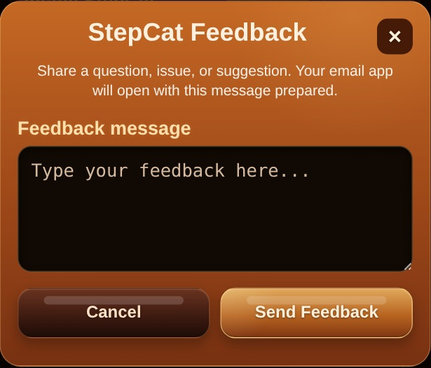 <strong>Enter a question, issue, or suggestion</strong></td>
<td align="center" width="50%">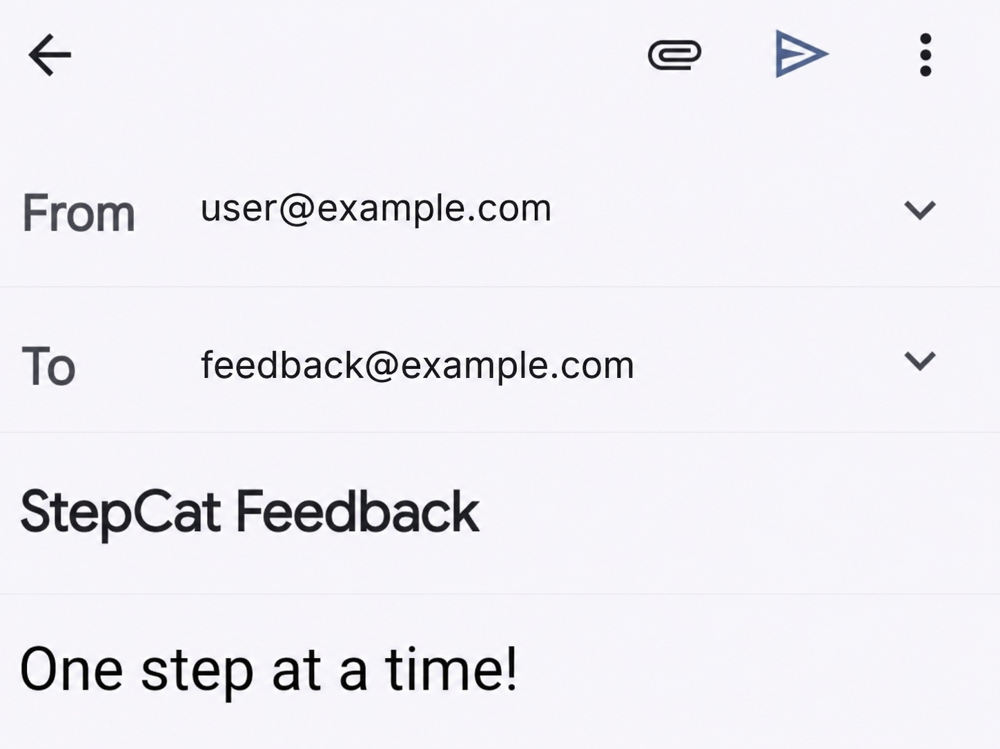 <strong>Email opens with the message prepared</strong></td>
</tr>
</table>

Open **Help (?)**, scroll to **Guides & Downloads**, and tap **Write Feedback**. The dialog opens over Help. After the email app opens, send the prepared message and return or swipe back to StepCat. The addresses shown above are generic examples; no feedback email address is stored in the workbook.

## Guides, downloads, and feedback

- [Illustrated Quick Start Guide — HTML](quick-start-guide.html)
- [Illustrated Quick Start Guide — PDF](StepCat_Quick_Start_Guide_v246.3.6.pdf)
- [Editable Quick Start Guide — DOCX](StepCat_Quick_Start_Guide_v246.3.6.docx)
- [Full Documentation](standalone.html)

To send feedback from StepCat, open **Help (?)**, scroll to **Guides & Downloads**, and tap **Write Feedback**. The form opens over Help; StepCat copies the message and opens the device's email app with the recipient and subject prepared.

## Public files

- `index.html` — StepCat webpage
- `service-worker.js` — offline cache
- `StepCat_Blank_Profitability_Analysis_Template.xlsx` — public workbook
- `README.md` — repository overview and illustrated workflow
- `quick-start-guide.html` — illustrated browser Quick Start Guide
- `StepCat_Quick_Start_Guide_v246.3.6.pdf` — downloadable illustrated PDF
- `StepCat_Quick_Start_Guide_v246.3.6.docx` — editable downloadable guide
- `standalone.html` — full documentation
- `images/` — current app and workbook screenshots
